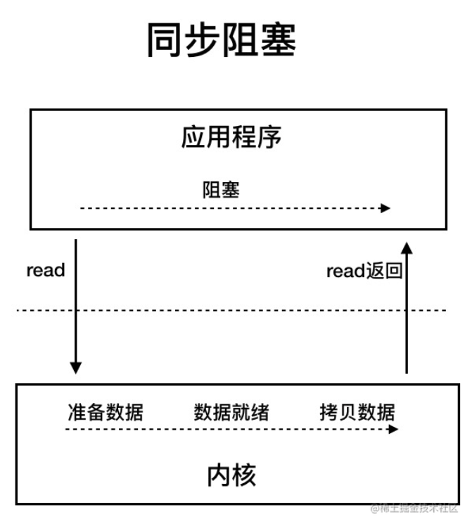

# Java

[笔记推荐 - JavaGuide](https://github.com/Snailclimb/JavaGuide/blob/main/README.md)

[笔记推荐 - 大厂面试指北](https://github.com/NotFound9/interviewGuide)

[笔记推荐 - 面渣逆袭](https://tobebetterjavaer.com/sidebar/sanfene/nixi.html)


## 基础模块

### Java环境

- JDK是开发环境 JDK包含Java程序的运行环境JRE和一些开发编译调试工具
- JRE是运行环境 JRE包含Java程序的运行基础JVM
- JVM是虚拟机


#### 编译过程

.java文件 通过Javac程序编译成 .class字节码文件 

再通过解释器或者JIT将字节码文件  解释为机器可以理解的机器码指令


需要注意的是在将字节码文件解释为机器码时  并不全是走的解释器也会走JIT
经常被调用的代码（也就是热点代码） 会进入JIT（即时编译器） 编译后的机器码会被保留下来
所以说Java时编译与解释共存的语言


#### JDK

Oracle JDK vs OpenJDK：

- 对于Java7而言OpenJDK和OracleJDK是十分接近的
  OracleJDK是基于OpenJDK7构建的 只添加了一些小功能
- OpenJDK 是一个参考模型并且是完全开源的
  OracleJDK 并不开源
- OpenJDK 是完全免费的
  OracleJDK 会提供免费版本 但一般有时间限制（不过 JDK8u221 之前只要不升级可以无限期免费）
- OracleJDK 在 OpenJDK 的基础上添加了一些特有的功能和工具
  在Java11之后 OracleJDK和OpenJDK的功能基本一致
- OpenJDK不提供LTS服务
  OracleJDK 大概每三年都会推出一个 LTS 版进行长期支持
  两者稳定性其实也是差不多的

推荐使用OpenJDK 因为免费开源


#### JVM

JVM 并不是只有一种 只要满足 JVM 规范谁都可以开发自己的专属 JVM
也就是说我们平时接触到的 HotSpot VM 仅仅是是 JVM 规范的一种实现而已


### 基础语法

#### 数据类型

Java 中有 8 种基本数据类型，分别为：

- 6 种数字类型：
  - 4 种整数型：`byte`、`short`、`int`、`long`
  - 2 种浮点型：`float`、`double`
- 1 种字符类型：`char`
- 1 种布尔型：`boolean`


#### 包装类型


##### 区别

- **用途**：除了定义一些常量和局部变量之外，我们在其他地方比如方法参数、对象属性中很少会使用基本类型来定义变量。并且，**包装类型可用于泛型，而基本类型不可以。**
- **存储方式**：基本数据类型的局部变量存放在 Java 虚拟机栈中的局部变量表中，基本数据类型的成员变量（未被 `static` 修饰 ）存放在 Java 虚拟机的堆中。包装类型属于对象类型，我们知道几乎所有对象实例都存在于堆中。
- **占用空间**：相比于包装类型（对象类型）， 基本数据类型占用的空间往往非常小。
- **默认值**：成员变量包装类型不赋值就是 `null` ，而基本类型有默认值且不是 `null`。
- **比较方式**：对于基本数据类型来说，`==` 比较的是值。对于包装数据类型来说，`==` 比较的是对象的内存地址。所有整型包装类对象之间值的比较，全部使用 `equals()` 方法。


##### 装箱拆箱

是指基本类型和包装类型之间的相互转换

```java
Integer i = 10;  //装箱
int n = i;   //拆箱
```


##### BigDecimal

`BigDecimal` 可以实现对浮点数的运算，不会造成精度丢失。通常情况下，大部分需要浮点数精确运算结果的业务场景（比如涉及到钱的场景）都是通过 `BigDecimal` 来做的。


### 基础难点

#### 接口和抽象类

> **接口和抽象类有什么共同点和区别？**
>
> 共同点：
>
> - 都不能被实例化
> - 都可以包含抽象方法
> - 都可以有默认实现的方法（Java 8 可以用 `default` 关键字在接口中定义默认方法）
>
> 区别：
>
> - 接口主要用于对类的行为进行约束 你实现了某个接口就具有了对应的行为
>   抽象类主要用于代码复用 强调的是所属关系
> - 一个类只能继承一个类  但是可以实现多个接口
> - 接口中的成员变量只能是 `public static final` 类型的  不能被修改且必须有初始值
>   抽象类的成员变量默认default  可在子类中被重新定义  也可被重新赋值

#### 深拷贝 浅拷贝

> **深拷贝和浅拷贝区别了解吗？什么是引用拷贝？**
>
> 引用拷贝 => 只是复制对象的引用
>
> 浅拷贝 => 复制对象 但对象内的引用对象不会复制
>
> 深拷贝 => 复制对象 对象内部的引用对象也会被复制
>
> Java默认实现的是浅克隆(Java的克隆好像是通过C++实现的) 需要深克隆的效果 只能自己实现
>
> 浅克隆：
>
> 
>
> 深克隆：
>
> 
>
> 

#### Object

> **Object中的常用方法？**

~~~java
/**
 * native 方法，用于返回当前运行时对象的 Class 对象，使用了 final 关键字修饰，故不允许子类重写。
 */
public final native Class<?> getClass()
/**
 * native 方法，用于返回对象的哈希码，主要使用在哈希表中，比如 JDK 中的HashMap。
 */
public native int hashCode()
/**
 * 用于比较 2 个对象的内存地址是否相等，String 类对该方法进行了重写以用于比较字符串的值是否相等。
 */
public boolean equals(Object obj)
/**
 * native 方法，用于创建并返回当前对象的一份拷贝。
 */
protected native Object clone() throws CloneNotSupportedException
/**
 * 返回类的名字实例的哈希码的 16 进制的字符串。建议 Object 所有的子类都重写这个方法。
 */
public String toString()
/**
 * native 方法，并且不能重写。唤醒一个在此对象监视器上等待的线程(监视器相当于就是锁的概念)。如果有多个线程在等待只会任意唤醒一个。
 */
public final native void notify()
/**
 * native 方法，并且不能重写。跟 notify 一样，唯一的区别就是会唤醒在此对象监视器上等待的所有线程，而不是一个线程。
 */
public final native void notifyAll()
/**
 * native方法，并且不能重写。暂停线程的执行。注意：sleep 方法没有释放锁，而 wait 方法释放了锁 ，timeout 是等待时间。
 */
public final native void wait(long timeout) throws InterruptedException
/**
 * 多了 nanos 参数，这个参数表示额外时间（以纳秒为单位，范围是 0-999999）。 所以超时的时间还需要加上 nanos 纳秒。。
 */
public final void wait(long timeout, int nanos) throws InterruptedException
/**
 * 跟之前的2个wait方法一样，只不过该方法一直等待，没有超时时间这个概念
 */
public final void wait() throws InterruptedException
/**
 * 实例被垃圾回收器回收的时候触发的操作
 */
protected void finalize() throws Throwable { }
~~~

#### hashCode()

> **hashCode() 有什么用？**
>
> 获取哈希码 哈希码的作用是确定该对象在哈希表中的索引位置
> Object的hashCode()方法是本地方法 也就是用C语言或C++实现的

#### hashCode

> **为什么要有 hashCode？**
>
> hashCode可以用来判断对象是否相等 （hashset的添加方法中也是先判断hashcode 如果相等再通过equals判断）
>
> 其实 hashCode()和equals()都是用于比较两个对象是否相等
> 不过hashcode可能重复 所以最后还需要用equals来判断确认
>
> 由此也引出了下一个问题
>
> 
>
> **为什么重写 equals() 时必须重写 hashCode() 方法？**
>
> 因为如果equals方法判断两个对象是相等的  那么两个对象的hashCode值必须是相等 所以要重写hashCode()
>
> 如果重写equals()时没有重写hashCode()方法的话
> 就可能会导致equals方法判断是相等的两个对象hashCode值却不相等。


#### String StringBuffer StringBuilder

> **String、StringBuffer、StringBuilder 的区别？**
>
> String 是不可变更的 因为string类是final修饰的 并且最终存储字符的数组也是final修饰的
> StringBuilder 非线成安全的字符串构建器
> StringBuffer 线成安全的字符串构建器
>
> 每次对 `String` 类型进行改变的时候，都会生成一个新的 `String` 对象，然后将指针指向新的 `String` 对象。
> `StringBuffer` 每次都是对 `StringBuffer` 对象本身进行操作，而不是生成新的对象并改变对象引用。
> 相同情况下使用 `StringBuilder` 相比使用 `StringBuffer` 仅能获得 10%~15% 左右的性能提升，但却要冒多线程不安全的风险。
>
> 1. 操作少量的数据: 适用 `String`
> 2. 单线程操作字符串缓冲区下操作大量数据: 适用 `StringBuilder`
> 3. 多线程操作字符串缓冲区下操作大量数据: 适用 `StringBuffer`

#### 字符串拼接

> **字符串拼接用“+” 还是 StringBuilder?**
>
> Java语言中特意为string重载了+和+=两个运算符
> str1+str等价于 StringBuilder调用append()再调用toString()
> 
>
> 需要注意的是 这个StringBuilder并不是单独的一个变量
> 所以如果是循环中使用的话 因为每次循环+都是单独的一次操作 所以都会生成一个单独的StringBuilder
> 这样会比较浪费内存影响性能

#### 字符串常量池

> **字符串常量池的作用了解吗？**
>
> JVM 为了提升性能和减少内存消耗 针对字符串（String 类）专门开辟的一块区域
> 主要目的是**为了避免字符串的重复创建**


#### 反射

> **获取class对象的三种方法**

~~~java
public class Get {
    //获取反射机制三种方式
    public static void main(String[] args) throws ClassNotFoundException {
        //方式一(通过建立对象)
        Student stu = new Student();
        Class classobj1 = stu.getClass();
        
        //方式二（所在通过路径-相对路径）
        Class classobj2 = Class.forName("fanshe.Student");
        
        //方式三（通过类名）
        Class classobj3 = Student.class;
    }
}
~~~


#### 新特性

接口默认方法

Lambda 表达式

函数式接口

方法引用

Optional

Streams

Parallel Streams

Maps

Date API


### 异常处理

Java 异常类层次结构图


#### Throwable

> **Throwable类常用方法有哪些**
>
> - `String getMessage()`: 返回异常发生时的简要描述
> - `String toString()`: 返回异常发生时的详细信息
> - `String getLocalizedMessage()`: 返回异常对象的本地化信息。使用 `Throwable` 的子类覆盖这个方法，可以生成本地化信息。如果子类没有覆盖该方法，则该方法返回的信息与 `getMessage()`返回的结果相同
> - `void printStackTrace()`: 在控制台上打印 `Throwable` 对象封装的异常信息


#### Exception Error

> **Exception 和 Error 有什么区别？**
>
> - **`Exception`** :程序本身可以处理的异常，可以通过 `catch` 来进行捕获。`Exception` 又可以分为 Checked Exception (受检查异常，必须处理) 和 Unchecked Exception (不受检查异常，可以不处理)。
> - **`Error`**：`Error` 属于程序无法处理的错误 ，~~我们没办法通过 `catch` 来进行捕获~~不建议通过`catch`捕获 。例如 Java 虚拟机运行错误（`Virtual MachineError`）、虚拟机内存不够错误(`OutOfMemoryError`)、类定义错误（`NoClassDefFoundError`）等 。这些异常发生时，Java 虚拟机（JVM）一般会选择线程终止。


#### Checked Exception

> **Checked Exception 和 Unchecked Exception 有什么区别？**
>
> Checked Exception 即受检查异常 ，Java 代码在编译过程中，如果受检查异常没有被 `catch`或者`throws` 关键字处理的话，就没办法通过编译。
>
> Unchecked Exception 即不受检查异常 ，Java 代码在编译过程中 ，我们即使不处理不受检查异常也可以正常通过编译。
>
> `RuntimeException` 及其子类都统称为非受检查异常  其他的`Exception`类及其子类都属于受检查异常


### 数据连接

JDBC： Java提供给数据库方的一套API

数据库连接驱动：各个数据库针对Java提供的API设计的具体连接驱动

Java程序通过 数据库连接驱动 就可连接上数据库


#### JDBC 执行过程

1. 注册驱动
2. JDBC执行
3. 执行预编译
4. 执行SQL
5. 封装结果集
6. 释放资源


#### MySQL 数据库驱动

`com.mysql.cj.jdbc.Driver`和`com.mysql.jdbc.Driver`是MySQL JDBC驱动程序的不同版本，其中`com.mysql.jdbc.Driver`是早期版本的驱动程序，而`com.mysql.cj.jdbc.Driver`是更新的版本。

下面是它们之间的一些区别：

1. JDBC API版本：`com.mysql.jdbc.Driver`使用JDBC 4.0 API，而`com.mysql.cj.jdbc.Driver`使用JDBC 4.2 API。

2. 协议：`com.mysql.jdbc.Driver`使用MySQL专有协议，而`com.mysql.cj.jdbc.Driver`使用标准的JDBC协议。

3. 时区处理：`com.mysql.cj.jdbc.Driver`支持更多的时区，包括UTC、GMT和ISO-8601，而`com.mysql.jdbc.Driver`只支持JVM默认时区。

4. 字符编码：`com.mysql.cj.jdbc.Driver`支持更广泛的字符集，包括UTF-8、UTF-16和UTF-32，而`com.mysql.jdbc.Driver`只支持ISO-8859-1和US-ASCII。

5. 其他特性：`com.mysql.cj.jdbc.Driver`还支持SSL加密、XA事务、IPv6和其他一些新特性，而`com.mysql.jdbc.Driver`则不支持这些特性。

因此，建议使用`com.mysql.cj.jdbc.Driver`，特别是在使用新的MySQL版本（5.7及以上）时，以支持更广泛的字符集、更多的时区和其他新特性。

### IO


#### 概念

 IO是计算机中Input和Output简称  即输入和输出
`输入流来读数据   输出流来写数据`

简单的可以将Java中的流分为四类 流的四种形式：


- BIO：Block IO 同步阻塞式 IO，就是我们平常使用的传统 IO，它的特点是模式简单使用方便，并发处理能力低。
- NIO：Non IO 同步非阻塞 IO，是传统 IO 的升级，客户端和服务器端通过 Channel（通道）通讯，实现了多路复用。
- AIO：Asynchronous IO 是 NIO 的升级，也叫 NIO2，实现了异步非堵塞 IO ，异步 IO 的操作基于事件和回调机制。

##### BIO

BIO 属于同步阻塞 IO 模型 
同步阻塞 IO 模型中，应用程序发起 read 调用后，会一直阻塞，直到内核把数据拷贝到用户空间。
在客户端连接数量不高的情况下，是没问题的。
但是，当面对十万甚至百万级连接的时候，传统的 BIO 模型是无能为力的。




##### NIO

Java 中的 NIO 于 Java 1.4 中引入，对应 `java.nio` 包，提供了 `Channel` , `Selector`，`Buffer` 等抽象。
它是支持面向缓冲的，基于通道的 I/O 操作方法。 对于高负载、高并发的（网络）应用，应使用 NIO 。

Java 中的 NIO 可以看作是 **I/O 多路复用模型**。也有很多人认为，Java 中的 NIO 属于同步非阻塞 IO 模型。

同步非阻塞模型：


同步非阻塞 IO 模型中，应用程序会一直发起 read 调用，等待数据从内核空间拷贝到用户空间的这段时间里，线程依然是阻塞的，直到在内核把数据拷贝到用户空间。
相比于同步阻塞 IO 模型，同步非阻塞 IO 模型确实有了很大改进。通过轮询操作，避免了一直阻塞。
但是，这种 IO 模型同样存在问题：应用程序不断进行 I/O 系统调用轮询数据是否已经准备好的过程是十分消耗 CPU 资源的。

I/O 多路复用模型：


IO 多路复用模型中，线程首先发起 select 调用，询问内核数据是否准备就绪，等内核把数据准备好了，用户线程再发起 read 调用。read 调用的过程（数据从内核空间 -> 用户空间）还是阻塞的。

**IO 多路复用模型，通过减少无效的系统调用，减少了对 CPU 资源的消耗。**


##### AIO

AIO 也就是 NIO 2。Java 7 中引入了 NIO 的改进版 NIO 2,它是异步 IO 模型

异步 IO 是基于事件和回调机制实现的，也就是应用操作之后会直接返回，不会堵塞在那里，当后台处理完成，操作系统会通知相应的线程进行后续的操作。

异步IO模型：


目前来说 AIO 的应用还不是很广泛。Netty 之前也尝试使用过 AIO，不过又放弃了。这是因为，Netty 使用了 AIO 之后，在 Linux 系统上的性能并没有多少提升。


#### 代码实现 - BIO

##### 字节写入

```java
//输出流
public static void outputStream() throws IOException{
    //创建一个File实例
    File file = new File("/home/wenhaibo/IOTest.txt");
    //FileOutputStream为文件输出流
    FileOutputStream out = new FileOutputStream(file);
    //将内容转换为字节码输出
    out.write("This is IOTest".getBytes());
    //强制输出内存中所有内容
    out.flush();
    //关闭输出流
    out.close();
}
```

##### 字节读取

```java
//输入流
public static void inputStream() throws IOException{
    //创建一个File实例
    File file = new File("/home/wenhaibo/IOTest.txt");
    //FileInputStream为文件输入流
    FileInputStream in = new FileInputStream(file);
    byte[] b = new byte[1024];
    //将 byte.length 个字节的数据读入一个 byte 数组中
    int len =in.read(b);
    //将字节码转为字符串打印输出
    System.out.println(new String(b, 0, len));
    //关闭输入流
    in.close();
}
```

##### 字符写入

```java
    //字符流
    public static void outputStreamWriter() throws IOException{
        //创建一个File实例
        File file = new File("/home/wenhaibo/IOTest.txt");
        //FileWriter为文件输出流
        Writer out = new FileWriter(file);
        //直接输出字符
        out.write("This is IOTest");
        //强制输出内存中所有内容
        out.flush();
        //关闭输出流
        out.close();
    }
```

##### 字符读取

```java
    public static void inputStreamReader() throws IOException{
        //创建一个File实例
        File file = new File("/home/IOTest.txt");
        //Reader为文件输入流
        Reader in=new FileReader(file);
        char[] c=new char[1024];
        //将 byte.length 个字节的数据读入一个 byte 数组中
        int len =in.read(c);
        //将字节码转为字符串打印输出
        System.out.println(new String(c, 0, len));
        //关闭输入流
        in.close();
    }
```

#### 缓冲流

Java缓冲流是在**输入流**和**输出流**之上进行了一次包装（装饰器设计模式）
目的是解决频繁写入/读取数据时效率差的问题  `缓冲流先将数据缓存起来  然后一起写入或读取出来`

字节缓冲流类：**BufferedInputStream 和** **BufferedOutputStream**
字符缓冲流类：**BufferedReader 和** **BufferedWriter**


### NIO


> 传统IO 基于字节流或字符流（如 FileInputStream、BufferedReader 等）进行文件读写
> 以及使用 Socket 和 ServerSocketopen 进行网络传
>
> NIO 使用 通道（Channel）和缓冲区（Buffer）进行文件操作
> 以及使用 SocketChannel 和 ServerSocketChannel 进行网络传输
>
> 实际上，“旧”的 I/O 包已经使用 NIO重新实现过 即使我们不显式的使用 NIO 编程也能从中受益

NIO的优势主要体现在网络通讯中：
NIO（New I/O）的设计目标是解决传统 I/O（BIO，Blocking I/O）在处理大量并发连接时的性能瓶颈。传统 I/O 在网络通信中主要使用阻塞式 I/O，为每个连接分配一个线程。当连接数量增加时，系统性能将受到严重影响，线程资源成为关键瓶颈。而 NIO 提供了非阻塞 I/O 和 I/O 多路复用，可以在单个线程中处理多个并发连接，从而在网络传输中显著提高性能。


### 序列化

#### 概念

**序列化：**把对象转化为可传输的字节序列过程称为序列化
**反序列化：**把字节序列还原为对象的过程称为反序列化

#### 实现

**java 实现序列化很简单，只需要实现 Serializable 接口即可**

#### 注意

- **static 属性不能被序列化** =》 静态属性
  序列化序列的是对象 而静态属性是属于类本身的部分 不属于对象
- **Transient 属性不会被序列化** =》 标志忽略
- **序列化版本号serialVersionUID** =》 版本匹配
  所有实现序列化的对象都必须要有个版本号  这个版本号可以由我们自己定义
  当我们没定义的时候JDK工具会按照我们对象的属性生成一个对应的版本号
  JDK生成的版本号 只要这个类有一点修改 就会重新生成 所以可能不是很友好
- **父类、子类序列化 ** =》 正向递归
  序列化是以正向递归的形式进行的  如果父类实现了序列化那么其子类都将被序列化
  子类实现了序列化而父类没实现序列化  那么只有子类的属性会进行序列化  而父类的属性是不会进行序列化的


## 集合框架

### 集合概述

#### 概念

Java集合框架图


Java中的集合类可以分为两大类：

- Collection接口：Collection是一个基本的集合接口  `Collection中可以容纳一组集合元素`（Element）
  - List接口：存储的元素是有序的、可重复的
    - ArrayList：数组
    - Vector：数组 线程安全的 现在基本不用
    - LinkedList：双向链表(JDK1.6 之前为循环链表，JDK1.7 取消了循环)
  - Set接口：存储的元素无序、不可重复的
    - HashSet：基于HashMap实现的 底层采用HashMap来保存元素
    - LinkedHashSet：LinkedHashSet是HashSet的子类，并且其内部是通过LinkedHashMap来实现的。
      有点类似于我们之前说的LinkedHashMap其内部是基于HashMap实现一样，不过还是有一点点区别的
    - TreeSet：红黑树(自平衡的排序二叉树)
  - Queue接口：存储的元素是有序的、可重复的、先进先出
    - PriorityQueue：数组来实现二叉堆
    - ArrayQueue：数组 + 双指针
- Map接口：`Map提供键（key）到值（value）的映射`  一个Map中不能包含相同的键  每个键只能映射一个值
  Map没有继承Collection接口  与Collection是并列关系
  - HashMap：
    - JDK1.8 之前HashMap由数组+链表组成的，数组是HashMap的主体，链表则是主要为了解决哈希冲突而存在的（“拉链法”解决冲突）。
    - JDK1.8 以后在解决哈希冲突时有了较大的变化，当链表长度大于阈值（默认为 8）（将链表转换成红黑树前会判断，如果当前数组的长度小于 64，那么会选择先进行数组扩容，而不是转换为红黑树）时，将链表转化为红黑树，以减少搜索时间
  - LinkedHashMap：LinkedHashMap继承自HashMap所以它的底层仍然是基于拉链式散列结构即由数组和链表或红黑树组成。另外LinkedHashMap在上面结构的基础上，增加了一条双向链表，使得上面的结构可以保持键值对的插入顺序。同时通过对链表进行相应的操作，实现了访问顺序相关逻辑。
  - Hashtable：数组+链表组成的，数组是Hashtable的主体，链表则是主要为了解决哈希冲突而存在的
  - TreeMap：红黑树（自平衡的排序二叉树）


#### 图述

两个接口的结构概述：


集合关系结构：


### Collection

#### 迭代概念

**介绍：**在介绍Collection框架之前 先说明一下Collection框架中比较重要的一个概念 **迭代**
在Collection顶层接口里就继承了Iterable 所以所有的Collection集合容器都是可迭代的

**概念：**迭代的概念其实就是指 `可以一个个的拿到集合容器中的元素`
实现了Iterable接口的集合 就可以通过Iterator取出集合中的元素
实现了Iterable说明是可迭代的 而Iterator是迭代器 最终是通过迭代器取出集合中的元素

**意义：**我们并不是只能通过迭代器去遍历集合  只不过通过`迭代器遍历集合能够解耦  把取数据这个操作交给迭代器 而不是我们直接去取数据` 这样在后面如果需要更换集合类型的时候只需要满足迭代条件即可 实现数据访问和底层数据的分离  这个设计模式也叫做迭代器模式

**注意：**`使用迭代器循环的时候不要用集合本身的添加和删除操作 否则会抛出ConcurrentModificationException异常`
没有确认过 但是大部分的集合都有一个modCount属性用来记录集合做了多少次修改 在使用迭代器循环的时候会校验这个修改次数 如果有改变说明有修改
`实现Iterable接口允许对象成为 for-each循环 语句的目标` （for-each 其实是Java提供的语法糖  实际上还是通过迭代器Iterator迭代遍历）

~~~java
// 源代码
List<Integer> list = new ArrayList<>();
for (Integer i : list) {
    // 代码块
}

// 编译后的.class文件
List<Integer> list = new ArrayList();
Iterator var2 = list.iterator();
while(var2.hasNext()) {
    Integer i = (Integer)var2.next();
    // 代码块
}
~~~

源码解析

1. 可迭代：**Iterable**

```java
   Iterator<T> iterator();// 返回迭代器。
   default void forEach(Consumer<? super T> action) {// 就是一个for循环写法的包装
       Objects.requireNonNull(action);
       for (T t : this) {
           action.accept(t);
       }
   }
   default Spliterator<T> spliterator() {// 通过一个顺序遍历的Iterator对象获取一个并行遍历的Spliterator对象
       return Spliterators.spliteratorUnknownSize(iterator(), 0);
   }
```

2. 迭代器：**Iterator**
   
~~~java
   // 迭代器的顶级接口 ==>>  Iterator
   boolean hasNext();// 是否存在下一个元素
   
   E next();// 取下一个元素
   
   default void remove() {
       throw new UnsupportedOperationException("remove");
   }
   
   default void forEachRemaining(Consumer<? super E> action) {// 遍历迭代器中剩余的元素
       Objects.requireNonNull(action);
       while (hasNext())
           action.accept(next());
   }
~~~

3. **Iterable** 和 **Iterator** 之间的关系
   Iterable 的作用是用来标注当前容器可以使用迭代器遍历 它会返回一个迭代器Iterator
   Iterator 的作用才是迭代功能的实现
   `Iterable是为了foreach循环设计的  Iterable表示集合可以返回Iterator对象  最终还是使用Iterator进行遍历。`

4. 也有人说为什么不直接将Iterator的功能整合到Iterable中？
   我看到的比较合理的解释是：**有些集合类可能不止一种遍历方式**  所以可能有不止一个的迭代器
   如：LinkedList实现了双向遍历和逆序遍历


#### 源码解析

**概述：**Collection是Java集合容器的顶级接口 和它并列的还有Map映射容器
Collection继承了Iterable 所以Java中的集合容器都是可迭代的

源码解析

~~~java
int size();// 容器的逻辑长度
int hashCode();// 容器的hashCode计算
boolean isEmpty();// 容器为空判断
boolean equals(Object o);// 容器相同判断

boolean contains(Object o);// 容器中是否包含参数元素
boolean containsAll(Collection<?> c);// 容器中是否包含参数集合的所有值

Object[] toArray();// 集合容器转数组
<T> T[] toArray(T[] a);// 也是将集合容器转成数组 但是不同的是可以通过参数指定转换出来的数组

boolean add(E e);// 容器添加元素+
boolean addAll(Collection<? extends E> c);// 容器批量添加 参数也需是集合类型数据

boolean remove(Object o);// 删除指定元素
boolean removeAll(Collection<?> c);// 批量移除 移除指定集合数据
void clear();// 清空
boolean retainAll(Collection<?> c);// 保留参数集合中的元素 删除参数集合中不存在的元素
// 删除所有满足条件的容器元素
default boolean removeIf(Predicate<? super E> filter) {
    Objects.requireNonNull(filter);// 过滤条件不能为null 为空抛出异常：NullPointerException
    boolean removed = false;// 最终返回值 标志是否有删除元素
    final Iterator<E> each = iterator();// 取出容器中的迭代器 通过迭代器循环删除
    while (each.hasNext()) {// 不存在下一个 跳出循环
        if (filter.test(each.next())) {// 判断是否符合过滤条件
            each.remove();// 符合就删除
            removed = true;// 记录删除成功
        }
    }
    return removed;
}

Iterator<E> iterator();// 取容器的迭代器

// 流操作 暂时留空
@Override
default Spliterator<E> spliterator() {
    return Spliterators.spliterator(this, 0);
}
default Stream<E> stream() {
    return StreamSupport.stream(spliterator(), false);
}
default Stream<E> parallelStream() {
    return StreamSupport.stream(spliterator(), true);
}
~~~


### List

概述：List 接口继承于 Collection 接口  `它可以定义一个允许重复的有序集合`

#### 特性

* 有序 可以重复 (顺序为存入的顺序)
* 允许多个null元素对象
* 可以使用迭代器`Iterator`取对象 也可以通过索引下标 
* List没有直接实现迭代器Iterator 而是实现了ListIterator

#### 源码解析

接口分析：

~~~java
//collection中介绍过的方法就直接注释了 不浪费时间
//int size();
//boolean isEmpty();
//boolean contains(Object o);
//boolean containsAll(Collection<?> c);
//boolean equals(Object o);
//int hashCode();
E get(int index);// 根据索引位置 取元素
E set(int index, E element);// 根据索引位置 设置元素
int indexOf(Object o);// 返回指定元素在 容器集合 中的索引位置
int lastIndexOf(Object o);// 返回指定元素在 容器集合 中最后一次出现的位置
List<E> subList(int fromIndex, int toIndex);// 从容器集合中截取一段 返回值是List接口

//Object[] toArray();
//<T> T[] toArray(T[] a);

//boolean add(E e);
void add(int index, E element);// 在指定位置插入元素
//boolean addAll(Collection<? extends E> c);
boolean addAll(int index, Collection<? extends E> c);// 在指定的位置批量插入

E remove(int index);// 删除指定索引位置元素
//boolean remove(Object o);
//boolean removeAll(Collection<?> c);
//void clear();
//boolean retainAll(Collection<?> c);
default void replaceAll(UnaryOperator<E> operator) {// 用指定的操作替换集合容器中的所有元素
    Objects.requireNonNull(operator);
    final ListIterator<E> li = this.listIterator();
    while (li.hasNext()) {
        li.set(operator.apply(li.next()));
    }
}

@SuppressWarnings({"unchecked", "rawtypes"})
default void sort(Comparator<? super E> c) {// 对集合容器中的元素进行排序 参数为比较器
    Object[] a = this.toArray();// 将当前List容器转换成数组
    Arrays.sort(a, (Comparator) c);// 用数组的排序
    ListIterator<E> i = this.listIterator();// 通过迭代器维护顺序
    for (Object e : a) {
        i.next();
        i.set((E) e);
    }
}

//Iterator<E> iterator();
ListIterator<E> listIterator();// 取List的迭代器
ListIterator<E> listIterator(int index);// 取指定位置的迭代器

@Override
default Spliterator<E> spliterator() {
    return Spliterators.spliterator(this, Spliterator.ORDERED);
}
~~~

ListIterator：

~~~java
// List接口的迭代器 =>>  ListIterator
// ListIterator和Iterator的区别在于 ListIterator是可以前后移动的 而Iterator是只能单向的迭代
//boolean hasNext();
//E next();

boolean hasPrevious();// 是否存在上一个元素
E previous();// 取上一个元素

int nextIndex();// 下一个元素的索引位置
int previousIndex();// 上一个元素的索引位置

void remove();// 删除
void set(E e);// 修改
void add(E e);// 添加
~~~


#### ArrayList

##### 概述

- 概述：`底层数据结构是数组` ArrayList是一个动态数组  它允许任何符合规则的元素插入甚至包括null

- 特性：`查改快`、`增删慢`、非线程安全、效率高

- 容量：ArrayList 的初始容量是（10） `ArrayList 存在扩容机制`
  ArrayList 在1.8之前都是直接创建一个长度10的数组 1.8是等到第一次赋值的时候才会创建
  - 扩容机制：**第一次赋值或超过数组容量时才触发扩容    扩容为1.5倍左右** 
    扩容机制是将原来的数组对象复制到新的数组对象中 新的数组长度是原来的1.5倍
    

###### 优势

由于底层实现是数组  查找效率为O(1)
因为数组内的对象都是同一类型  所以在查询的时候只需要根据单个对象内存和索引下标就可以找到对应的元素

###### 缺点

增删操作慢 因为增加删除会涉及到元素的复制移动以及数组整体的扩容
另外数组的长度是固定的 相对来说 会造成一定的空间浪费

###### 性能问题

ArrayList 存在两个问题
因为底层的数据结构是数组 数组的长度是固定的 所以在ArrayList数据存储达到最大值时 会触发扩容机制 而`扩容机制相对来说比较消耗性能`
第二个问题是ArrayList在进行头插入和中间插入时 会将所有受到影响的元素 重新排序  而`重新排序相对来说比较消耗性能`

###### 解决方案

针对ArrayList存在的两个问题 也有对应的解决方案
第一个 针对扩容机制 `推荐在数组创建的时候 就指定好数组的长度`
第二个 针对头插入中间插入需要重新排序 `推荐使用尾插入`

###### 画图解析

结构：


增删操作：


##### 源码解析

###### 构造函数

~~~java
private static final Object[] DEFAULTCAPACITY_EMPTY_ELEMENTDATA = {};
public ArrayList() {
    // 在JDK8中无参构造 得到的是一个空数组引用 并没创建数组
    this.elementData = DEFAULTCAPACITY_EMPTY_ELEMENTDATA;
}

private static final Object[] EMPTY_ELEMENTDATA = {};
public ArrayList(int initialCapacity) {
    if (initialCapacity > 0) {// 指定长度大于0 那么创建指定长度的数组
        this.elementData = new Object[initialCapacity];
    } else if (initialCapacity == 0) {// 长度为0 那么也是指向一个预定义的空数组 而不是去创建一个空数组
        this.elementData = EMPTY_ELEMENTDATA;
    } else {// 负数抛出异常
        throw new IllegalArgumentException("Illegal Capacity: "+ initialCapacity);
    }
}

public ArrayList(Collection<? extends E> c) {
    Object[] a = c.toArray();// 将继承了Collection接口的参数 转换成数组
    if ((size = a.length) != 0) {// 先将数组的长度赋值为arraylist的长度 并判断是否不为0
        if (c.getClass() == ArrayList.class) {// 判断继承collection对象的是不是arraylist
            elementData = a;// 如果是直接赋值替换
        } else {
            elementData = Arrays.copyOf(a, size, Object[].class);// 如果不是那就将数组的元素复制进arraylist
        }
    } else {// 如果传进来的collection为空 那么也指向预定义的空数组
        elementData = EMPTY_ELEMENTDATA;
    }
}
~~~

###### 长度方法

为什么要把这个简单的方法单独提出来呢 因为方便下面的理解 
ArrayList中的size并不是数组的长度  他只是一个逻辑长度  只是元素的长度   `数组的长度永远都是固定` 比如长度为10的数组里面只维护了8个元素 size是8

~~~java
// 获取数组的长度
public int size() {
    return size;
}
~~~

###### 添加方法

~~~java
//元素添加方法
public boolean add(E e) {
    ensureCapacityInternal(size + 1);  // 判断是否能存储进
    elementData[size++] = e;// 把需要添加的元素放到指定索引位置
    return true;
}
private void ensureCapacityInternal(int minCapacity) {
    ensureExplicitCapacity(calculateCapacity(elementData, minCapacity));
}
private static int calculateCapacity(Object[] elementData, int minCapacity) {// 参数minCapacity是当前数组应该有的最小长度
    if (elementData == DEFAULTCAPACITY_EMPTY_ELEMENTDATA) {// 判断当前数组对象是否是预定义的空数组
        return Math.max(DEFAULT_CAPACITY, minCapacity);// 返回默认的数组长度10 如果传进来的参数大于默认长度 使用传进来的长度
    }
    return minCapacity;// 如果不是直接返回
}
private void ensureExplicitCapacity(int minCapacity) {
    modCount++;// 记录修改次数
    if (minCapacity - elementData.length > 0)// 判断数组添加后的最小长度 是否比当前数组长度更长
        grow(minCapacity);// 扩容
}
private void grow(int minCapacity) {// 扩容
    // overflow-conscious code
    int oldCapacity = elementData.length;// 取当前数组的长度
    int newCapacity = oldCapacity + (oldCapacity >> 1);// 取当前数组位移1后的长度 也就是1.5倍
    if (newCapacity - minCapacity < 0)// 如果新长度小于现在长度
        newCapacity = minCapacity;// 那么取现有的长度
    if (newCapacity - MAX_ARRAY_SIZE > 0)// 如果新长度大于数组的最大值
        newCapacity = hugeCapacity(minCapacity);// 大于数组的最大值 那么取Integer.MAX_VALUE
    // minCapacity is usually close to size, so this is a win:
    elementData = Arrays.copyOf(elementData, newCapacity);// 使用数组的复制
}

//指定索引位置的添加
public void add(int index, E element) {
    rangeCheckForAdd(index);
    ensureCapacityInternal(size + 1);
    //最重要的就是这句 复制 数组中的元素是能移动的 只能一个个的复制
    System.arraycopy(elementData, index, elementData, index + 1, size - index);
    elementData[index] = element;
    size++;
}
~~~

###### 删除方法

~~~java
// 通过索引删除数组元素
public E remove(int index) {
    rangeCheck(index);
    modCount++;// 记录操作次数
    E oldValue = elementData(index);// 记录需要删除的元素
    int numMoved = size - index - 1;
    if (numMoved > 0)// 逻辑长度减索引再减1 如果大于0 说明不是最后一个元素
        System.arraycopy(elementData, index+1, elementData, index, numMoved);// 删除的元素不是最后一位的话 需要移动受影响的元素 从而保证数组的正常访问
    elementData[--size] = null; // clear to let GC do its work  源代码中这里也写了注解 把数组最后一位的引用置空 让GC去回收
    return oldValue;// 返回前面被删除的对象
}

// 通过对象删除数组元素
public boolean remove(Object o) {
    if (o == null) {// 判断需要删除的元素是否为null
        for (int index = 0; index < size; index++)// 如果是null 那就循环数组进行删除
            if (elementData[index] == null) {
                fastRemove(index);
                return true;
            }
    } else {
        for (int index = 0; index < size; index++)// 如果要删除的元素不是null 那么就通过元素的equals方法进行对比 判断是相同的就删除
            if (o.equals(elementData[index])) {
                fastRemove(index);
                return true;
            }
    }
    return false;
}
private void fastRemove(int index) {// 这个就不写了  基本和索引删除一致
    modCount++;
    int numMoved = size - index - 1;
    if (numMoved > 0)
        System.arraycopy(elementData, index+1, elementData, index, numMoved);
    elementData[--size] = null; // clear to let GC do its work
}
~~~

##### 总结

`ArrayList 本质上就是一个操作数组的容器 在数组的基础上封装了一系列的方法：扩容、复制、序列化、插入、删除、修改`
这里只列举了ArrayList的初始化、添加删除的源码  修改（set）和查询（get）都没有列举  因为逻辑都比较简单没必要在这里浪费时间

根据上面源码的分析 得出的结论是 **当我们需要处理大量数据的时候 频繁插入/删除元素 会使底层数组频繁拷贝 效率不高内存空间浪费**
当然 也有例外 如果我们能在一开始就知道 数据的长度 以及只做尾操作  也是能保证ArrayList的时间复杂度为O(1)


#### LinkedList

##### 概述

- 概述：`底层数据结构是链表 双向链表` **非同步的**
  LinkedList是一个基于链表实现的**双向队列** 所以链表也是双向链表

- 特性：`查改慢`、`增删快`、非线程安全、效率高

- 注意
  - 除了基础的List接口的功能外 在LinkedList中还维护了 头尾两个对象 **可以直接对头尾进行操作** 
    而LinkedList也继承了队列的接口  头尾对象是根据队列的接口维护的 队列接口中还提供了对头尾进行操作的方法
    除了头尾操作外push、pop、poll....等方法也都是有实现 不过这里是作为List接口下的LinkedList来介绍 关于队列的用法 后面可能会补充吧
  - 由于是双向链表所以 **LinkedList 不能随机访问**  因为链表结构决定LinkedList只能通过节点的信息去循环查找（没有索引所以不能直接找到节点）

###### 优势

`增删比较快 时间复杂度是O(1)`
因为不管是头、尾、中间那个地方操作  都影响的节点最多就是前后两个节点
不过需要注意的是 LinkedList 在删除前需要找到需要删除的对象  在指定位置添加前也需要找到指定位置的元素
而查询的过程需要循环查找 所以并不是说LinkedList的增删就一定快

###### 缺点

查改比较慢 时间复杂度是O(n)
LinkedList不能随机访问 因为他没有索引 不能根据索引直接找到数据 `必须通过循环查找`

###### 画图解析

LinkedList结构：


堆中的结构：


##### 源码分析

###### 构造函数

~~~java
// LinkedList的两个构造函数没什么好说的 比较简单
public LinkedList() {
}
public LinkedList(Collection<? extends E> c) {
    this();// 调用无参构造
    addAll(c);// 把传进来的collection参数添加进链表对象
}

// 构造函数没啥好说的  说说LinkedList的属性
// 链表的逻辑长度（跟数组不同逻辑长度就是实际长度）
transient int size = 0;
// 头节点对象
transient Node<E> first;
// 尾节点对象
transient Node<E> last;
// 这个Node就是链表的一个个节点对象  是LinkedList的一个内部类
private static class Node<E> {
    E item;// 当前节点的元素
    Node<E> next;// 下一节点
    Node<E> prev;// 上一节点
    // 注意这里存的是前后节点 而不是前后节点中的元素 因为链表需要通过节点串联起来
    Node(Node<E> prev, E element, Node<E> next) {
        this.item = element;
        this.next = next;
        this.prev = prev;
    }
}
~~~

###### 添加方法

~~~java
// 直接添加 相当于尾插入
public boolean add(E e) {
    linkLast(e);// 直接调了尾插入
    return true;
}
// 头插入
public void addFirst(E e) {
    linkFirst(e);// 直接调了头插入
}
// 尾插入
public void addLast(E e) {
    linkLast(e);// 直接调了尾插入
}
// 指定位置插入 并不是说是中间插入 
// 因为如果指定的位置是最后一个 实际就相当于是尾插入
// 不过不能进行头插入 会抛出异常：IndexOutOfBoundsException
public void add(int index, E element) {
    checkPositionIndex(index);// 指定的位置 必须大于零 小于链表的size
    //index >= 0 && index <= size
    if (index == size)// 判断指定位置和逻辑长度
        linkLast(element);// 相等直接调用尾插入
    else
        linkBefore(element, node(index));// 不相等 说明为中间插入
}
// 根据指定位置取节点对象
Node<E> node(int index) {// LinkedList中取元素 除了直接取头尾节点 都是通过这个方法循环取指定位置的节点
    // 性能相对ArrayList的直接根据索引取来说 是比较慢的
    if (index < (size >> 1)) {
        Node<E> x = first;// 先赋头节点的值
        for (int i = 0; i < index; i++)// 循环取到index位置的节点对象
            x = x.next;
        return x;
    } else {// 逻辑同上
        Node<E> x = last;
        for (int i = size - 1; i > index; i--)
            x = x.prev;
        return x;
    }
}

void linkLast(E e) {
    final Node<E> l = last;// 先记录原来的尾节点
    final Node<E> newNode = new Node<>(l, e, null);// 把当前传进来的元素包装成节点
    last = newNode;// 把当前节点 设置为新的尾节点
    if (l == null)// 原来的尾节点不存在
        first = newNode;// 把头节点也指向当前节点
    else// 原来的尾节点存在
        l.next = newNode;// 把原尾节点的下一节点引用设置为新尾节点
    size++;// 逻辑长度加1
    modCount++;// 记录修改次数
}
private void linkFirst(E e) {// 头插入的逻辑与尾插入的逻辑 基本一直
    final Node<E> f = first; 
    final Node<E> newNode = new Node<>(null, e, f); 
    first = newNode;
    if (f == null)
        last = newNode; 
    else
        f.prev = newNode;
    size++;
    modCount++;
}
// 中间插入
void linkBefore(E e, Node<E> succ) {// 基本逻辑一致 没啥好说的
    // assert succ != null; 
    final Node<E> pred = succ.prev;
    final Node<E> newNode = new Node<>(pred, e, succ);
    succ.prev = newNode;
    if (pred == null)
        first = newNode;
    else
        pred.next = newNode;
    size++;
    modCount++;
}
~~~

###### 删除方法

~~~java
// 删除指定位置
public E remove(int index) {
    checkElementIndex(index);// 校验index 保证是正确数据 错误数据抛出异常：IndexOutOfBoundsException
    // 校验规则：index >= 0 && index < size
    return unlink(node(index));// 校验通过 直接调用nulink（node方法在上面说了 不再重复）
}
// 删除指定对象 需要equals方法支持
public boolean remove(Object o) {// 参数o是需要删除的对象
    if (o == null) {// 如果需要删除的对象是null
        for (Node<E> x = first; x != null; x = x.next) {// 从头节点开始 取下一节点 一直取到下一节点是null
            if (x.item == null) {// 当前节点元素为null 直接调用unlink移除元素
                unlink(x);
                return true;
            }
        }
    } else {// 逻辑基本同上 唯一不同是判断对象相同的手段 这里用的是equals方法
        for (Node<E> x = first; x != null; x = x.next) {
            if (o.equals(x.item)) {
                unlink(x);
                return true;
            }
        }
    }
    return false;
}

// 移除指定节点
E unlink(Node<E> x) {// 参数x是需要移除的节点对象
    // assert x != null;
    final E element = x.item;// 取出需要移除节点的元素
    final Node<E> next = x.next;// 取处需要移除节点的下一节点引用
    final Node<E> prev = x.prev;// 取出需要移除节点的上一节点引用

    if (prev == null) {// 如果上一节点为null 说明需要移除的节点是头节点
        first = next;// 直接将LinkedList中的头节点对象设置为 需要移除节点的下一节点
    } else {// 如果不是头节点
        prev.next = next;// 设置上一节点的下一节点为需要移除节点的下一节点
        x.prev = null;// 置空需要移除节点的上一节点
    }

    //处理next的逻辑同上面的prev 不再重复
    if (next == null) {
        last = prev;
    } else {
        next.prev = prev;
        x.next = null;
    }

    x.item = null;// 最后置空需要移除节点的元素本身 （到此为止 链表中已经不存在对item的引用 GC会在何时的时候处理掉item）
    size--;// 逻辑长度更新
    modCount++;// 操作记录加一
    return element;// 返回之前保存的item的引用
}
~~~

###### 查改方法

~~~java
// 查改放在一起是因为逻辑比较简单 这里简单提下
// 取指定位置的元素
public E get(int index) {
    checkElementIndex(index);// 这个校验在删除的时候提过 不在重复
    return node(index).item;// 通过node方法取到 节点对象 返回节点中的元素
}
public E getFirst() {// 直接取头节点
    final Node<E> f = first;
    if (f == null)// 头节点为空抛出异常
        throw new NoSuchElementException();
    return f.item;
}
public E getFirst() {// 直接取尾节点
    final Node<E> f = first;
    if (f == null)// 尾节点为空抛出异常
        throw new NoSuchElementException();
    return f.item;
}

// 修改方法 修改指定位置的元素
public E set(int index, E element) {
    checkElementIndex(index);
    Node<E> x = node(index);
    E oldVal = x.item;
    x.item = element;
    return oldVal;
}
~~~

##### 总结

`LinkedList就是一个实现了双向链表双向对列结构的容器  `
`并对这个双向链表结构的数据实现了：插入、删除、修改、查询、序列化等一系列操作的包装`


#### 其他

##### ~~Vector~~

概述：`底层数据结构是数组`  **Vector 是线程安全的动态数组**   Vector 是同步的  它的操作与 ArrayList 几乎一样

特性：查改快、增删慢、线程安全、效率低  不推荐使用

注意：

- **只要是关键性的操作，方法前面都加了synchronized关键字，来保证线程的安全性**。 
- **Vector的扩容机制是1倍**

##### ~~Stack~~

概述：`Stack实现的是一个后进先出的堆栈` Stack 继承自 Vector 
Stack 提供 5 个额外的方法使得 Vector 得以被当作堆栈使用 
基本的 push 和 pop 方法 还有 

- peek 方法得到栈顶的元素
- empty 方法测试堆栈是否为空
- search 方法检测一个元素在堆栈中的位置

#### 知识点

> **ArrayList 与 LinkedList 区别?**
>
> array底层结构是数组 linke底层结构是链表 他们的区别最主要也是因为他们的底层数据结构的问题
> 数组结构决定了array的查询修改快 增删慢  链表结构决定了linke的查询修改慢 增删快
> 但实际上array的增删慢是相对而言 其实也不慢 而且合理的使用尾插法和尾删法 以及在创建得时候预估好长度
> array的效率是远远大于linked的 大多数情况下也都是使用的array很少有使用linked的


### Set

概述：`Set是一种不包含重复的元素的 Collection 无序` 即任意的两个元素 e1 和 e2 都有 e1.equals(e2)=false  Set最多有一个 null 元素
`Set 集合中的去重和 hashcode 与 equals 方法直接相关` 通过这两个方法来判断两个对象是否相等
关于Set的具体实现  我就不做过多介绍 因为HashSet的底层是HashMap的实现 很多功能都是直接套用的HashMap
TreeSet也一样 基本是TreeMap的套用

特性
- 无序 不可重复 (`元素的位置是固定的 但顺序不是固定的`)
- 最多允许一个null元素对象
- 取对象时只能通过迭代器 `Iterator` 因为没有索引下标

Java 对 Set 有三种实现方式

- HashSet 通过 HashMap 实现，HashMap 的 Key 即 HashSet 存储的元素，Value 系统自定义一个名为 PRESENT 的 Object 类型常量。判断元素是否相同时，先比较 hashCode，相同后再利用 equals 比较，查询 O(1)
- LinkedHashSet 继承自 HashSet，通过 LinkedHashMap 实现，使用双向链表维护元素插入顺序
- TreeSet 通过 TreeMap 实现的，底层数据结构是红黑树，添加元素到集合时按照比较规则将其插入合适的位置，保证插入后的集合仍然有序。查询 O(logn)


#### HashSet

概述：底层数据结构是HashMap  (无序、唯一、非同步)  它是由 HashMap 实现的
HashSet 允许使用null元素  但只能有一个
**HashSet 按 Hash 算法来存储集合的元素，因此具有很好的存取和查找性能。**

依赖两个方法：hashCode()和equals() 保证元素唯一性

1. hashCode()：
2. equals()：

HashSet底层由HashMap实现
HashSet的值存放于HashMap的key上
HashMap的value统一为PRESEN

举例：HashSet的add方法，直接调用HashMap的put方法，将添加的元素作为key，new一个Object作为value（PRESEN），直接调用HashMap的put方法，它会根据返回值是否为空来判断是否插入元素成功。


#### TreeSet

概述：底层数据结构是红黑树  (唯一、有序)   其底层是基于 TreeMap 实现的  非线程安全
TreeSet 可以确保集合元素处于排序状态。**TreeSet 支持两种排序方式，自然排序和定制排序，其中自然排序为默认的排序方式。**当我们构造 TreeSet 时，若使用不带参数的构造函数，则 TreeSet 的使用自然比较器；若用户需要使用自定义的比较器，则需要使用带比较器的参数。

注意：TreeSet 集合不是通过 hashcode 和 equals 函数来比较元素的. 它是通过 compare 或者 comparaeTo 函数来判断元素是否相等. compare 函数通过判断两个对象的 id，相同的 id 判断为重复元素，不会被加入到集合中。


#### LinkedHashSet

概述：底层数据结构是链表和哈希表  (FIFO插入有序、唯一)
LinkedHashSet 继承自 HashSet  其底层是**基于 LinkedHashMap 来实现的**  有序、非同步
LinkedHashSet 集合同样是根据元素的 hashCode 值来决定元素的存储位置  但是它同时使用链表维护元素的次序   这样使得元素看起来像是以插入顺序保存的
当遍历该集合时候  **LinkedHashSet 将会以元素的添加顺序访问集合的元素。**

1. 由链表保证元素有序
2. 由哈希表保证元素唯一


### Map

#### HashMap

##### 概述

HashMap 键值对、无序、非线程安全、效率高
HashMap允许null值（key和value都允许）  key不能重复
数据结构 在 1.7及之前是：**数组加链表**    1.8是：**数组加链表/红黑树**

##### 优缺点

- 数组 -- 查询效率 O(1)  能直接通过hash值找到位置 不用做其他操作
  不过数组的长度是固定的  如果超出长度  需要进行扩容  而数组扩容是一个比较消耗性能的操作
  总结：`在HashMap中最好一开始指定好长度 减少扩容`
- 链表 -- 查询效率 O(n)  需要通过循环  一个个链过去 不能直接找到数据
  在1.7的JDK中 链表是通过头插入的  在1.8的JDK中 链表是通过尾插入的  尾插入属于优化
  头插的优点在于：比尾插效率更高 不需要遍历找到最后一个节点 只需要把新节点的下一个指向原头节点 把hash桶中的引用改为新节点 
  头插的缺点在于：在多线程的情况下 多个线程一起扩容的时候可能会造成一个循环链表 循环链表会导致永远找不到尾节点 导致死循环
  总结：在HashMap中链表的长度最好控制的比较低 因为长链表影响查询效率 HashMap中给出的长度是8超过就要考虑树化 长度低于6就会转成链表
- 红黑树 -- 查询效率 O(log(n))  需要通过树来查找  决定效率的是树的深度
  因为红黑树的特性：左子节点比根节点小 右子节点比根节点大 可以在查询的时候减少查询次数
  总结：红黑树是一个自平衡的二叉树  在HashMap中最好不要用到  虽然他会提高链表过长导致的查询效率问题（链表过长的情况很少出现 hash碰撞的概率还是比较小的）
  但它是自平衡的 所以需要考虑在插入和删除数据的时候 维护平衡所带来的性能问题 左旋右旋 而且树节点比链表节点更大
  另外需要注意的是HashMap中 树化需要两个条件  第一个是链表的长度超过8 第二个是数组的长度超过64
- 总结：`推荐在使用HashMap的时候 最好给一个初始化容量 减少数组扩容次数 提高性能  也能降低链表的长度 最好不要使用到红黑树`

##### 源码

关系结构：

 

###### HashMap内部结构


###### 常量

~~~java
// 数组默认容量 2的四次方 位运算 16
static final int DEFAULT_INITIAL_CAPACITY = 1 << 4; // aka 16
// 数组最大容量 2的三十次方 Integer的最大值 但这是hash桶的最大值 并不是hashmap的最大值 到这个最大值hash桶就不会再扩容
static final int MAXIMUM_CAPACITY = 1 << 30;
// 负载因子 触发扩容机制的比例
static final float DEFAULT_LOAD_FACTOR = 0.75f;
// 树化的阈值 在链表长度达到8的时候 就可能会触发树化
static final int TREEIFY_THRESHOLD = 8;
// 链表化阈值 在树的长度小于6的时候 就会触发链表化
static final int UNTREEIFY_THRESHOLD = 6;
// 触发树化的最小hash桶值 触发树化的第二个决定条件 hash桶的长度最少要有64才华
static final int MIN_TREEIFY_CAPACITY = 64;
~~~

###### 变量

~~~java
// Hash桶对象
transient Node<K,V>[] table;

transient Set<Map.Entry<K,V>> entrySet;
// 逻辑长度
transient int size;
// 修改次数
transient int modCount;
// 数组容器扩容阈值
int threshold;
// 实际的负载因子
final float loadFactor;
~~~

###### 添加

~~~java
public V put(K key, V value) {
    return putVal(hash(key), key, value, false, true);
}
// 实际的添加数据方法
// 参数：key的hash值 | key | value | 是否覆盖值 | 
final V putVal(int hash, K key, V value, boolean onlyIfAbsent, boolean evict) {
    // tab hash桶的临时变量
    // p hash桶中新数据需要存入的位置
    // n hash桶长度的临时变量
    // i 新数据需要存入的索引
    Node<K,V>[] tab; Node<K,V> p; int n, i;
    // 首先把hash桶赋值给临时变量tab 然后判断hash桶是否为null 或者hash桶长度为零
    if ((tab = table) == null || (n = tab.length) == 0)
        n = (tab = resize()).length;// 符合条件说明 hash桶需要通过resize方法调整大小 最终把调整后的大小赋值给变量n
    // 从hash桶中取数据 数据位置是根据 hash桶长度和key的hash值 求出来的：(n - 1) & hash
    if ((p = tab[i = (n - 1) & hash]) == null)// p的位置 数据为null 说明没有数据
        tab[i] = newNode(hash, key, value, null);// 直接将新数据 创建成node节点存入
    else {// p位置 不为null 说明存在数据
        Node<K,V> e; K k;
        // p的hash 等于 新数据的hash 并且 （新数据的key等于p的key 或者 他们equals相等）
        if (p.hash == hash && ((k = p.key) == key || (key != null && key.equals(k))))// 键相等 说明是需要覆盖数据
            e = p;// 直接把p赋值给变量e
        else if (p instanceof TreeNode)// 如果p是树节点
            e = ((TreeNode<K,V>)p).putTreeVal(this, tab, hash, key, value);// 执行树节点的数据存入
        else {// 不符合以上两种情况 说明：需要以链表的形式存入数据
            for (int binCount = 0; ; ++binCount) {// 死循环 只有break跳出
                // 通过赋值 e是p的下一节点
                if ((e = p.next) == null) {// p的下一节点为null
                    p.next = newNode(hash, key, value, null);// 将p的下一节点指向新数据
                    if (binCount >= TREEIFY_THRESHOLD - 1) // 判断链表是否需要树化
                        treeifyBin(tab, hash);// 树化操作
                    break;// 结束循环
                }
                // e的hash等于新数据的hash 并且 （e的key等于新数据的key）
                if (e.hash == hash && ((k = e.key) == key || (key != null && key.equals(k))))
                    break;// 新数据等于链表上的一个节点数据 结束循环
                p = e;//不符合 上面两种情况 把e赋值给p p变成了自己的下一节点
            }
            // for循环中 第一个if判断的是下一节点为null没有数据 直接把新数据赋值上去  属于新增操作
            // 第二个if判断的是下一节点的key和新数据的key相等  属于修改操作
        }
        // 通过上面的判断 
        // 1- e可能是hash桶中的第一个节点
        // 2- e可能是树节点
        // 3- e可能是链表上的节点
        if (e != null) {// e不为空 上面三种情况下e不为null 只会是e是原本就存在的数据
            V oldValue = e.value;// 先保留下e原本的数据 oldvalue
            if (!onlyIfAbsent || oldValue == null)// 如果参数onlyIfAbsent为false 或者原数据为null
                e.value = value;// 直接给e赋新值
            afterNodeAccess(e);// 预留位置
            return oldValue;// 返回被覆盖的原数据
        }
    }
    ++modCount;// 记录修改次数
    if (++size > threshold)// 判断逻辑长度是否大于阈值
        resize();// 大于阈值的化 调整容器尺寸
    afterNodeInsertion(evict);// 预留位置
    return null;// 不是覆盖数据的情况 就返回null
}
// 这两个方法是预留的位置  在LinkedHashMap中有实现
void afterNodeAccess(Node<K,V> p) { }
void afterNodeInsertion(boolean evict) { }

// 容器尺寸调整
final Node<K,V>[] resize() {
    Node<K,V>[] oldTab = table;// 保留一个原数组容器
    int oldCap = (oldTab == null) ? 0 : oldTab.length;// 原数组容器的长度
    int oldThr = threshold;// 原阈值
    int newCap, newThr = 0;// 新的长度 新的阈值
    if (oldCap > 0) {// 原数组容器长度大于零
        if (oldCap >= MAXIMUM_CAPACITY) {// 原数组容器长度大于或等于数组最大值
            threshold = Integer.MAX_VALUE;// 阈值最大只能是Integer的最大值 因为threshold是int类型
            return oldTab;// 直接返回原数组容器
        }
        // 通过旧长度计算出新长度 如果新长度小于数组容器最大值 并且 旧长度大于默认数组容器大小
        // 扩容的大小是 oldCap << 1 左移一位 也就是扩容两倍
        else if ((newCap = oldCap << 1) < MAXIMUM_CAPACITY && oldCap >= DEFAULT_INITIAL_CAPACITY)
            newThr = oldThr << 1; // 这种情况下计算出来的 新长度 = oldCap << 1 新阈值 = oldThr << 1
    }
    else if (oldThr > 0) // 如果原阈值 大于零 原数组容器等于零 （说明是hashmap刚刚初始化）
        newCap = oldThr;// 直接将原阈值 赋给新长度
    else {// 原阈值 原数组容器长度 都为零 一切都取默认值
        newCap = DEFAULT_INITIAL_CAPACITY;// 新长度取默认长度
        newThr = (int)(DEFAULT_LOAD_FACTOR * DEFAULT_INITIAL_CAPACITY);// 新阈值取 默认负载因子 乘 默认长度
    }
    if (newThr == 0) {// 如果 新阈值为零
        float ft = (float)newCap * loadFactor;// 新长度 乘 负载因子
        // 新阈值 = 新长度小于容器最大长度 并且 新长度乘负载因子小于容器最大长度 为真取计算结果 为假取Integer最大值
        newThr = (newCap < MAXIMUM_CAPACITY && ft < (float)MAXIMUM_CAPACITY ? (int)ft : Integer.MAX_VALUE);
    }
    // 通过上面的一系列判断处理 只会有两种情况
    // 第一：原长度大于等于数组容量最大值 不再进行扩容处理 直接返回原数组容器
    // 第二：重新计算新长度和新阈值 接下来根据新长度进行扩容
    threshold = newThr;// 把新阈值赋给阈值属性
    @SuppressWarnings({"rawtypes","unchecked"})// 用于抑制编译器产生警告信息
    Node<K,V>[] newTab = (Node<K,V>[])new Node[newCap];// 创建一个新长度的数组容器
    table = newTab;// 把新容器赋给原数组
    if (oldTab != null) {// 原数组容器不为空
        for (int j = 0; j < oldCap; ++j) {// 根据原长度循环
            Node<K,V> e;
            if ((e = oldTab[j]) != null) {// 原hash桶节点赋值e e不为空
                oldTab[j] = null;// 原节点先置空
                if (e.next == null)// 如果 原节点不存在下一节点 只有一层
                    newTab[e.hash & (newCap - 1)] = e;// 直接在新数组容器中存放e
                else if (e instanceof TreeNode)// 如果e是树节点类型
                    ((TreeNode<K,V>)e).split(this, newTab, j, oldCap);// 进行树节点的处理
                else { // 剩下的就是链表结构的处理
                    Node<K,V> loHead = null, loTail = null;
                    Node<K,V> hiHead = null, hiTail = null;
                    Node<K,V> next;// 下一节点
                    do {
                        next = e.next;
                        if ((e.hash & oldCap) == 0) {// 如果e在hash桶数组容器中的位置是0 需要考虑null的情况
                            if (loTail == null)
                                loHead = e;
                            else
                                loTail.next = e;
                            loTail = e;
                        }
                        else {
                            if (hiTail == null)
                                hiHead = e;
                            else
                                hiTail.next = e;
                            hiTail = e;
                        }
                    } while ((e = next) != null);// 循环链表 组成一个链表对象
                    // 将组织好的链表对象 赋到数组容器中
                    if (loTail != null) {
                        loTail.next = null;
                        newTab[j] = loHead;
                    }
                    if (hiTail != null) {
                        hiTail.next = null;
                        newTab[j + oldCap] = hiHead;
                    }
                }
            }
        }
    }
    // 返回新数组容器
    return newTab;
}
// treeifyBin 树化
final void treeifyBin(Node<K,V>[] tab, int hash) {
    int n, index; Node<K,V> e;
    if (tab == null || (n = tab.length) < MIN_TREEIFY_CAPACITY)
        resize();// 优先进行数组扩容 而不是树化
    else if ((e = tab[index = (n - 1) & hash]) != null) {
        TreeNode<K,V> hd = null, tl = null;
        do {
            TreeNode<K,V> p = replacementTreeNode(e, null);// 把链表节点替换成树节点
            if (tl == null)
                hd = p;
            else {
                p.prev = tl;
                tl.next = p;
            }
            tl = p;
        } while ((e = e.next) != null);// 循环替换
        if ((tab[index] = hd) != null)
            hd.treeify(tab);// 把该节点连接的所有节点组成一棵树（树化的过程）
    }
}
~~~

###### 删除

```java
public V remove(Object key) {
    Node<K,V> e;
    return (e = removeNode(hash(key), key, null, false, true)) == null ? null : e.value;
}

final Node<K,V> removeNode(int hash, Object key, Object value, boolean matchValue, boolean movable) {
    Node<K,V>[] tab; Node<K,V> p; int n, index;
    if ((tab = table) != null && (n = tab.length) > 0 && (p = tab[index = (n - 1) & hash]) != null) {
        Node<K,V> node = null, e; K k; V v;
        if (p.hash == hash && ((k = p.key) == key || (key != null && key.equals(k))))
            node = p;// 如果直接能在hash桶数组容器中查到 直接赋值给node
        else if ((e = p.next) != null) {// 不在hash桶中 也就是要么在树节点上 要么在链表上
            if (p instanceof TreeNode)// 是树节点对象 说明在树上
                node = ((TreeNode<K,V>)p).getTreeNode(hash, key);// 获取树节点对象
            else {
                do {
                    if (e.hash == hash &&
                        ((k = e.key) == key ||
                         (key != null && key.equals(k)))) {
                        node = e;
                        break;
                    }
                    p = e;
                } while ((e = e.next) != null);// 循环取链表上节点
            }
        }
        if (node != null && (!matchValue || (v = node.value) == value || (value != null && value.equals(v)))) {
            if (node instanceof TreeNode)// 如果是树节点 通过树节点的删除方法删除
                ((TreeNode<K,V>)node).removeTreeNode(this, tab, movable);
            else if (node == p)// 如果是hash桶中的头节点 直接把hash桶中的位置指向头节点
                tab[index] = node.next;
            else// 把上一节点的下一节点指向node的下一节点
                p.next = node.next;
            ++modCount;// 记录修改次数
            --size;// 逻辑长度减一
            afterNodeRemoval(node);// 预留位置
            return node;// 返回删除的节点
        }
    }
    return null;
}
```

###### 添加逻辑


###### 查询逻辑


##### 问题

- hashmap数组的长度为什么是 2 的幂次方？
  提升扩容的效率 数组长度都是2的幂次方的话 位置计算起来更方便
  哪怕你传入的不是2的幂次方 hashmap也会给你转成2的幂次方
- hashmap是懒加载 默认大小是16
  树化阈值是8 链表化阈值是6 树化hash桶的元素阈值是64
  负载因子是0.75
- hashmap如何解决线程安全问题？
  使用concurrentHashMap（推荐）、或者使用Collection.synchronizedMap


##### 总结

hashmap在1.7和1.8之间的区别
1.7是数组加链表
1.8是数组加链表加红黑树

为什么树化的节点是8：因为哈希碰撞的概率是递减的 节点累计到8的情况是0.00000006
为什么链表化的节点是6不是8：如果链表长度在7、8之间波动 会导致链表和红黑树不停转换


#### LinkedHashMap

LinkedHashMap维护了一个双向链表 有头尾节点
他的内部节点entry继承自hashmap的node 并且还有 before 和 after 用来标注前后节点


#### TreeMap

**概述：**有序、非线程安全、效率高（O(logN)）  但比不上HashMap (O(1))


#### HashTable

**概述：**无序、线程安全、效率低 数组加链表构成
除构造函数外  HashTable的所有 public 方法声明中都有 synchronized关键字  所以是线程安全的
**HashTable和HashMap的区别 除了同步之外 就是HashTable不支持null（KV都不允许）**


#### ConcurrentHashMap

##### 概述

线程安全的HashMap 性能高于HashTable
ConcurrentHashMap 同样也分为 1.7 、1.8 版，两者在实现上略有不同

1.7 的实现：如图所示 是由 Segment 数组、HashEntry 组成   和 HashMap 一样  仍然是数组加链表


##### Segment 源码

Segment 是ConcurrentHashMap的内部类

~~~java
static final class Segment<K,V> extends ReentrantLock implements Serializable {
    private static final long serialVersionUID = 2249069246763182397L;
    // 和 HashMap 中的 HashEntry 作用一样，真正存放数据的桶
    transient volatile HashEntry<K,V>[] table;
    transient int count;
    transient int modCount;
    transient int threshold;
    final float loadFactor;
}
~~~


可以看出来跟 HashMap 基本没啥差别 （唯一的差别的就是用 volatile 修饰了 value 和 next volatile 的作用我就不解释了）

原理上来说：**ConcurrentHashMap 采用了分段锁技术**，其中 Segment 继承于 ReentrantLock。不会像 HashTable 那样不管是 put 还是 get 操作都需要做同步处理，理论上 ConcurrentHashMap 支持 CurrencyLevel (Segment 数组数量)的线程并发。每当一个线程占用锁访问一个 Segment 时，不会影响到其他的 Segment。

**1.8 在 1.7 的数据结构上做了大的改动**：

- 采用红黑树之后可以保证查询效率（`O(logn)`）
- 甚至取消了 ReentrantLock 改为了 synchronized
- 也使用到了CAS


##### 总结

**JDK7的 ConcurrentHashMap 就是在HashMap的基础上又加了一层 segment**
segment 的长度也决定了 ConcurrentHashMap 的并发程度
而 ConcurrentHashMap 保证线程安全的办法是：

- 成员变量通过 volatile 标识
- put 的时候通过Lock保证


**JDK8的 ConcurrentHashMap 舍弃了segment使用synchronized以及CAS无锁** 

之所以不用Lock是因为JDK8的synchronized做了优化（锁升级）所以在性能上跟Lock差不多


## 并发编程

#### 基础认知

**并发：**并发的关键是你有处理多个任务的能力  不一定要同时

**并行：**并行的关键是你有同时处理多个任务的能力

**同步：**通过控制和调度  来保证多线程中共享资源的数据一致性

 线程安全：用来描绘一段代码 指在并发的情况之下 该代码经过多线程使用 线程的调度顺序不影响任何结果
 就是指一段代码在处理多个任务的过程中 `不会因为多个任务而影响最终的结果`

##### 线程状态

 

##### 线程池

###### 定义

线程池 其实就是一种基于`池化思想`的管理线程的工具
线程池 维护多个线程  等待监督管理者分配可并发执行的任务

- 避免了处理任务时创建销毁线程开销的代价
- 避免了线程数量膨胀导致的过分调度问题  保证了对内核的充分利用

###### 好处

- `降低资源消耗`：通过池化技术重复利用已创建的线程，降低线程创建和销毁造成的损耗。
- `提高响应速度`：任务到达时，无需等待线程创建即可立即执行。
- `提高线程的可管理性`：线程是稀缺资源，如果无限制创建，不仅会消耗系统资源，还会因为线程的不合理分布导致资源调度失衡，降低系统的稳定性。使用线程池可以进行统一的分配、调优和监控。
- `提供更多更强大的功能`：线程池具备可拓展性，允许开发人员向其中增加更多的功能。比如延时定时线程池ScheduledThreadPoolExecutor，就允许任务延期执行或定期执行。

###### 使用

在《阿里巴巴 Java 开发手册》“并发处理”这一章节，明确指出线程资源必须通过线程池提供，不允许在应用中自行显式创建线程。

另外，《阿里巴巴 Java 开发手册》中强制线程池不允许使用 `Executors` 去创建，而是通过 `ThreadPoolExecutor` 构造函数的方式，这样的处理方式让写的同学更加明确线程池的运行规则，规避资源耗尽的风险

###### 流程


##### 线程切换

线程在执行过程中会有自己的运行条件和状态（也称上下文），比如上文所说到过的程序计数器，栈信息等。当出现如下情况的时候，线程会从占用 CPU 状态中退出。

- 主动让出 CPU，比如调用了 `sleep()`, `wait()` 等。
- 时间片用完，因为操作系统要防止一个线程或者进程长时间占用 CPU 导致其他线程或者进程饿死。
- 调用了阻塞类型的系统中断，比如请求 IO，线程被阻塞。
- 被终止或结束运行


##### AQS

AQS 的全称为 `AbstractQueuedSynchronizer` ，翻译过来的意思就是抽象队列同步器。这个类在 `java.util.concurrent.locks` 包下面。

简单来说AQS 为构建锁和同步器提供了一些通用功能的实现
Java实现的锁 很多都是基于AbstractQueuedSynchronizer实现的 如ReentrantLock就是（是不是全部我不确认）


CLH 队列

Java实现锁的最重要的就是需要一套能将线程阻塞等待以及被唤醒时锁分配的机制
AQS中就是CLH队列

CLH(Craig,Landin,and Hagersten) 队列是一个虚拟的双向队列（虚拟的双向队列即不存在队列实例，仅存在结点之间的关联关系）。AQS 是将每条请求共享资源的线程封装成一个 CLH 锁队列的一个结点（Node）来实现锁的分配。在 CLH 同步队列中，一个节点表示一个线程，它保存着线程的引用（thread）、 当前节点在队列中的状态（waitStatus）、前驱节点（prev）、后继节点（next）。

结构图：


原理图：


##### 线程顺序

###### CountDownLatch

在实际开发中 我们可能需要保证 多个线程全部执行完成再执行接下来的代码
所以就引入了CountDownLatch  具体的[相关博客参考](https://www.cnblogs.com/wanglongjiang/p/17144475.html)

~~~java
public void countDownLatch() {
    ExecutorService executorService = Executors.newCachedThreadPool();
    final CountDownLatch countDownLatch = new CountDownLatch(5);
    int i = 1;
    while (i <= 5) {
        int finalI = i;
        executorService.execute(() -> {
            try {
                System.out.println("线程" + finalI + "开始");
                Thread.sleep(5000);
                System.out.println("线程" + finalI + "结束");
                countDownLatch.countDown();
            } catch (InterruptedException e) {
                e.printStackTrace();
            }
        });
        i++;
    }
    countDownLatch.await();
    System.out.println("结束");
}
~~~

countDownLatch的使用环境是所有线程全部执行完成后 再执行接下来的代码
await方法不加参数就是一直等countDownLatch为0的时候才解锁 继续执行
await带参数的方法可以指定等待时间 超过时间直接执行接下来的代码

###### CyclicBarrier

CyclicBarrier的作用是等待所有线程都执行完才结束
在我看来跟CountDownLatch的效果差不多 具体的就不演示了[参考博客](https://www.cnblogs.com/niujifei/p/15837425.html)


#### 线程创建

##### Thread

~~~java
public static void main(String[] args) {
    System.out.println("主线程启动："+Thread.currentThread().getName());
    new Thread02().start();
}

public class Thread02 extends Thread {
    @Override
    public void run() {
        System.out.println("子线程启动："+Thread.currentThread().getName());
    }
}
~~~

- 通过继承thread类实现的多线程 虽然实现的是`run`方法  但是要启动线程的话 应该是通过`start`方法 
  启动了多少次start就相当于启动了多少个子线程

  run方法相当于只是指定了子线程中需要处理的事情  而真正的创建、启动线程是start方法

  `start方法也只是将线程调整到准备就绪的状态  cpu并不一定是立马执行 需要等待调度`

- run方法中的代码执行完毕后 线程就是死亡

- 不推荐使用 避免OOP单继承局限性


##### Runnable

~~~java
public static void main(String[] args) {
    // 通过lambda表达式的形式实现runnable接口 启动线程
    new Thread(()->{System.out.println("子线程启动："+Thread.currentThread().getName());}).start();
}
~~~

- 一般都是使用匿名内部类或者`lambda表达式`的形式实现runnable接口 实现新线程的启动 本质上thread类也是实现了runnable接口的 构造函数中也是可以接口runnable接口的 所以才支持这样的线程启动方式
- 推荐使用 避免了单继承的局限性


##### Callable

~~~java
    public static void main(String[] args) throws ExecutionException, InterruptedException {
        // 实现任务对象
        FutureTask<String> task = new FutureTask<String>(() -> {
            System.out.println("子线程启动" + Thread.currentThread().getName());
            return "成功了";
        });
        // 将任务对象传递到新线程 启动
        new Thread(task).start();
        // 获取打印任务返回的结果
        System.out.println(task.get());
    }
~~~

- 与runnable接口不同 callable接口可以实现有返回值的线程创建  并且可以抛出异常
- 实现了callable接口任务 需要装载futuretask对象中 因为futuretask对象继承了runnable接口 所以可以通过futuretask对象来启动线程 多线程任务的返回结果可以通过futuretask获取
- 通过get获取线程任务的返回值  需要注意的是 get可能会造成阻塞  因为在get的时候是在等待线程任务完成 如果在get之前线程任务完成了 那么就不会造成阻塞


##### 线程池

~~~java
public static void main(String[] args)  {
    // region thread pool 实现方式
    // 使用executors创建一个线程池
    ExecutorService executorService = Executors.newCachedThreadPool();
    
    // 线程池实现runnable接口启动线程
    executorService.execute(() -> {
        System.out.println("子线程启动：" + Thread.currentThread().getName());
    });

    // 线程池实现callable接口启动线程
    Future<?> submit = executorService.submit(() -> {
        System.out.println("子线程启动：" + Thread.currentThread().getName());
        return "成功了";
    });
    // 还是通过futuretask获取返回值
    System.out.println(submit.get());
    // endregion
}
~~~

- 线程池的话 不用手动创建thread类  而是通过线程池的Executors框架来创建线程开启线程
- 使用Executors对象创建线程池 返回一个线程服务对象 通过线程服务对象 来操作和管理线程
- 线程池种类：
  - newCachedThreadPool  创建一个`可缓存线程池`
    如果线程池长度超过处理需要，可灵活回收空闲线程，若无可回收，则新建线程。
  - newFixedThreadPool 创建一个定长线程池
    可控制线程最大并发数  超出的线程会在队列中等待
  - newScheduledThreadPool 创建一个定长线程池
    支持定时及周期性任务执行
  - newSingleThreadExecutor 创建一个`单线程化的线程池`
    它只会用唯一的工作线程来执行任务，保证所有任务按照指定顺序(FIFO, LIFO, 优先级)执行。


##### @Async

~~~java
@Async
public void springThread() throws InterruptedException {
    Thread.sleep(3000);
    System.out.println("子线程启动："+Thread.currentThread().getName());
}
~~~

- 标记了@Async的方法在spring中将被认作异步方法  在调用的时候会开启新线程来处理
  需要注意@Async方法不能和调用者在同一个类中
- spring的@async注解底层实现应该使用了线程池  这里不做过深的研究


#### 常见方法

##### run

作用：子类通常需要重写Thread类中的run()方法，run()中写你想让该线程执行的代码。

##### start

作用：启动当前线程  并调用当前线程中的run()方法

并不是真正的启动 只是把当前线程状态调整为准备就绪 可以被cpu调度

##### yield

作用：释放当前线程的操作

执行yield()方法，cpu会释放当前线程，去执行其它的线程，过后还是会继续执行该线程，
具体什么时候执行该线程，看cpu调度。这里放弃的应该时间片段

##### join

作用：阻塞当前线程 等待join的线程完成

如果在线程a中调用了线程b的join()方法，此时线程a就会进入阻塞状态，直到线程b完全执行完以后，线程a才会结束阻塞状态，由于join方法中会抛出异常，所以我们还需要try-catch来捕捉处理异常

##### sleep

作用：阻塞当前线程 并定时唤醒 不会释放锁

sleep()方法内的形参为long millitime,调用该方法会让当前线程“睡眠”指定的millitime（毫秒），在指定的millitime毫秒的时间内，当前的线程是阻塞状态。

##### isAlive

作用：判断当前线程是否活跃

isAlive()方法用来判断当前线程是否存活，如果当前线程存活，返回true,如果消亡，返回false

##### currrentThread

作用：返回当前执行代码的线程，该方法为静态方法，直接通过Thread类名调用

##### wait

作用：线程自动释放其占有的对象锁 并等待notify

wait notify notifyall 三个方法 也是与线程相关的方法  但是`这三个方法是用Object提供的`

需要注意的是 `使用这三个方法的时候当前线程必须获取到当前对象的锁` 如果没有那么会抛出异常

##### notify

作用：唤醒一个正在wait当前对象锁的线程  并让它拿到对象锁

具体唤醒哪一个线程由虚拟机控制

##### notifyAll

作用：唤醒所有正在wait前对象锁的线程

被唤醒的线程 它们只是跳出了wait状态 接下来它们还会是竞争对象锁


#### 线程池

##### 原理

###### 图解

线程池采用的是生产者消费者模型


###### 执行流程

线程池中有三个参数是最为关键的：核心线程数、最大线程数、任务缓冲阻塞队列

首先设置核心线程数=10 最大线程数=20 任务缓冲阻塞队列=10
那么在首先十个线程任务进入线程池中由核心线程处理
接下来再进入十个线程任务 将会进入任务缓冲阻塞队列中阻塞
最后再进入十个线程任务 将会新建线程处理

###### 常用线程池实现

- newCachedThreadPool

  ~~~java
  public static ExecutorService newCachedThreadPool() {
      return new ThreadPoolExecutor(0, Integer.MAX_VALUE,
                                    60L, TimeUnit.SECONDS,
                                    new SynchronousQueue<Runnable>());
  }
  ~~~

  本质上就是没有核心线程、任务队列也无法添加的线程池
  每个任务都是单独新建的一个线程

- newSingleThreadExecutor

  ```java
  public static ExecutorService newSingleThreadExecutor() {
      return new FinalizableDelegatedExecutorService
          (new ThreadPoolExecutor(1, 1,
                                  0L, TimeUnit.MILLISECONDS,
                                  new LinkedBlockingQueue<Runnable>()));
  }
  ```

  本质上就是只有一个核心线程、任务队列能够无限缓存阻塞的线程池
  每个任务都是在上一个任务结束后执行

- newFixedThreadPool

  ```java
  public static ExecutorService newFixedThreadPool(int nThreads) {
      return new ThreadPoolExecutor(nThreads, nThreads,
                                    0L, TimeUnit.MILLISECONDS,
                                    new LinkedBlockingQueue<Runnable>());
  }
  ```

  本质上就是一个任务队列能够无限缓存阻塞的线程池


##### 动态化线程池


#### 线程安全

##### 锁概念

在Java中 保证线程安全的方案分为两种：同步、无同步、

造成线程安全问题的原因就是：多线程情况下共享变量的写操作不安全  所以解决方案也就是针对共享的变量进行的 同步共享变量 或者 不同步共享变量


###### 同步

- 互斥(阻塞)：互斥是实现同步的一种手段 属于**悲观的并发策略**

  `多线程并发访问共享数据时 保证共享数据在同一时刻只被一个线程使用`  临界区、互斥量和信号量都是主要的互斥实现方式

  Java中实现互斥的手段：

  - synchronized 关键字
  - lock 接口

  互斥最主要的问题就是进行`线程阻塞和唤醒`所带来的性能问题

- 非阻塞：**基于冲突检测的乐观并发策略**

  非阻塞的同步 其实就是在多线程访问共享变量的时候 先操作的线程会成功 后面的线程会失败 而失败的线程并不会阻塞挂起 而实采取其他的补偿措施 比如不断重试直到成功

  非阻塞的实现 CAS：

  - CAS指令需要有3个操作数，分别是内存地址（在java中理解为变量的内存地址，用V表示）、旧的预期值（用A表示）和新值（用B表示）
  - CAS指令执行时，CAS指令指令时，当且仅当V处的值符合旧预期值A时，处理器用B更新V处的值，否则它就不执行更新，但是无论是否更新了V处的值，都会返回V的旧值，上述的处理过程是一个原子操作。

  CAS的缺点：

  - ABA问题：因为CAS需要在操作值的时候检查下值有没有发生变化，如果没有发生变化则更新，但是一个值原来是A，变成了B，又变成了A，那么使用CAS进行检查时会发现它的值没有发生变化，但是实际上却变化了。

    ABA问题的解决思路：使用版本号 记录修改次数
  
  在Java中`java.util.concurrent.atomic`包下面的原子变量类就是使用了乐观锁的一种实现方式**CAS**实现的：
  
  - 基本类型
  
    - `AtomicBoolean` - 布尔类型原子类
  
    - `AtomicInteger` - 整型原子类
  
    - `AtomicLong` - 长整型原子类
  
      .......

> **ThreadLocal 内存泄露问题是怎么导致的？**
>
> `ThreadLocalMap` 中使用的 key 为 `ThreadLocal` 的弱引用，而 value 是强引用。所以，如果 `ThreadLocal` 没有被外部强引用的情况下，在垃圾回收的时候，key 会被清理掉，而 value 不会被清理掉。
>
> 这样一来，`ThreadLocalMap` 中就会出现 key 为 null 的 Entry。假如我们不做任何措施的话，value 永远无法被 GC 回收，这个时候就可能会产生内存泄露。`ThreadLocalMap` 实现中已经考虑了这种情况，在调用 `set()`、`get()`、`remove()` 方法的时候，会清理掉 key 为 null 的记录。使用完 `ThreadLocal`方法后最好手动调用`remove()`方法
>
> **ThreadLocal怎么实现的呢？**
>
> Thread类有一个类型为ThreadLocal.ThreadLocalMap的实例变量threadLocals  每个线程都有一个属于自己的ThreadLocalMap
> ThreadLocalMap内部维护着Entry数组  每个Entry代表一个完整的对象  key是ThreadLocal的弱引用  value是ThreadLocal的泛型值
> 每个线程在往ThreadLocal里设置值的时候  都是往自己的ThreadLocalMap里存  读也是以某个ThreadLocal作为引用  在自己的map里找对应的key  从而实现了线程隔离
> ThreadLocal本身不存储值 它只是作为一个key来让线程往ThreadLocalMap里存取值


###### 无同步

- 对象不共享

  直接不使用共享变量

- 不可变对象

  多线程对共享变量只能进行读操作

- 线程本地变量

  直接把变量交给线程封闭起来 这样也不会被其他线程共享 自然也就不会有安全问题
  ThreadLocal 就是线程本地变量


###### 总结

- Java中线程安全的解决方案可以简单的理解为 **同步** **不同步** 两种 --> 针对共享变量
- 在同步方案中又分为 **互斥同步**(悲观实现) 和 **非阻塞同步**(乐观实现) 两种 --> 针对同步方式
- 而不同步方案 其实就是只对共享变量进行读操作 或者直接没有共享变量 --> 针对程序设计


##### synchronized

###### 概述

synchronized是Java中的关键字 可以给方法和代码块加锁  (synchronized底层好像是通过C实现的) 
可以保证方法或者代码块在运行时  同一时刻只有一个线程可以进入到临界区（临界区就是synchronized锁住的区域）

Java中每一个对象都可以作为锁  这是synchronized实现同步的基础
因为在Java中每个对象都有一个内置锁(监视器,也可以理解成锁标记)
而synchronized就是使用对象的内置锁(监视器)来将代码块(方法)锁定的

- synchronized可以给方法和代码块加锁
- 加锁解锁的过程都是自动的 
- synchronized关键字编译之后
  会在同步块的前后分别形成`monitorenter`和`monitorexit`这两个字节码指令 
  这两个字节码指令都需要一个reference类型的参数来指明要锁定和解锁的对象

- 优点
  - 加锁 解锁 过程都是底层帮我们处理了
  - java的关键字 jvm原生支持

- 缺点
  - 效率低，`试图获取锁时不能设定超时时间`
    未得到锁的线程只能不停的尝试获得锁  而不能中断  高并发的情况下会导致性能下降
  - 不够灵活  只能使用某个对象作为锁  且加锁和释放的时机单一
  - 无法知道是否成功获得锁
  - 锁的类型不可更改：可重入 不可中断 非公平

###### 示例

~~~java
// 直接加在方法上 相当于当前方法为同步方法
// 加锁对象的话 实例类是this 静态类是class对象 （区别在于 一个锁住的是一个单独的实例 一个是整个静态类对象）  
public synchronized void Test1() {
    System.out.println("-----Test1------");
}

// 直接使用synchronized关键字 实现同步代码块 加锁对象程序员指定 一般指定为this
public void Test2(){
    synchronized (this){
        System.out.println("-----Test2------");
    }
}
~~~

###### 优化

synchronized 属于重量级锁 1.6后Java对他进行了优化 出现了一个锁升级的概念（`锁是不能降级的`）
升级路线是：无锁 =》 偏向锁 =》 轻量级锁 =》 重量级锁

- 无锁：没有线程访问同步代码块时的状态
- 偏向锁：当有一个线程访问同步代码块时  无锁的就会升级为偏向锁 `偏向当前线程`（也就是第一个访问同步代码块的线程）
- 轻量级锁：当出现锁竞争的时候 偏向锁就会升级为轻量级锁
  轻量级锁也就是自旋锁 线程会自旋十次 `自旋是指竞争失败的线程循环获取锁`（正常应该是竞争失败的线程阻塞）
  失败十次后 就会锁膨胀 （线程的自旋次数可以自己指定）
- 重量级锁：在轻量级锁自旋失败后 就会升级为重量级锁 也就是synchronized本来的级别


##### lock

###### 概述

本质上Lock仅仅是一个接口
Lock有三个实现类

- ReentrantLock：表示重入锁  它是唯一一个实现了Lock接口的类
  重入锁指的是线程在获得锁之后 再次获取该锁不需要阻塞 而是直接关联一次计数器增加重入次数
- ReentrantReadWriteLock：重入读写锁 它实现了ReadWriteLock接口
  在这个类中维护了两个锁
  - ReadLock：读锁
  - WriteLock：写锁

###### 示例

~~~java
Lock l = ...; //根据不同的实现Lock接口类的构造函数得到一个锁对象 
l.lock(); //获取锁位于try块的外面 
try { 
      // 代码块
} finally { 
     l.unlock(); // 推荐把锁放到finally中 这样不管怎样都会被释放
}
~~~

###### 接口方法

~~~java
//尝试获取锁，获取成功则返回，否则阻塞当前线程
void lock(); 

//尝试获取锁，线程在成功获取锁之前被中断，则放弃获取锁，抛出异常 
void lockInterruptibly() throws InterruptedException; 

//尝试获取锁，获取锁成功则返回true，否则返回false 
boolean tryLock(); 

//尝试获取锁，若在规定时间内获取到锁，则返回true，否则返回false，未获取锁之前被中断，则抛出异常 
boolean tryLock(long time, TimeUnit unit) throws InterruptedException; 

//释放锁
void unlock(); 

//返回当前锁的条件变量，通过条件变量可以实现类似notify和wait的功能，一个锁可以有多个条件变量
Condition newCondition();
~~~

推荐文章：[一文带你理解 Java 中 Lock 的实现原理](https://juejin.cn/post/6844903680399917069)


##### AQS

AQS是一个用来构建锁和同步器的框架 使用AQS能简单且高效地构造出应用广泛的同步器

###### 内部结构

AQS内部使用了一个volatile的变量state来作为资源的标识
同时提供了几个获取和改变state的protected方法 子类可以覆盖这些方法来实现自己的逻辑

```java
getState()
setState()
compareAndSetState()
```

这三种操作均是原子操作 其中compareAndSetState的实现依赖于Unsafe的compareAndSwapInt()方法

AQS内部使用了一个先进先出（FIFO）的双端队列
并使用了两个指针head和tail用于标识队列的头部和尾部
它并不是直接储存线程 而是储存拥有线程的Node节点


###### 源码分析

AQS采用了模板模式 将一些具体的实现延迟到子类中
这里提到一个设计思路 在AQS的抽象类中 下面这些逻辑方法并不是抽象方法 而是直接抛出异常
之所以不设计成抽象方法是因为 不想强制要求子类都去实现这些逻辑
子类只需要根据自己的逻辑进行实现即可

- isHeldExclusively()：该线程是否正在独占资源 只有用到condition才需要去实现它
- 独占方式
  - tryAcquire(int)：尝试获取资源 成功则返回true 失败则返回false
  - tryRelease(int)：尝试释放资源 成功则返回true 失败则返回false
- 共享方式
  - tryAcquireShared(int)：尝试获取资源
    负数表示失败
    0表示成功 但没有剩余可用资源
    正数表示成功 且有剩余资源
  - tryReleaseShared(int)：尝试释放资源
    如果释放后允许唤醒后续等待结点返回true 否则返回false

###### 加锁逻辑

1. 获取资源
   首先调用 tryAcquire(arg) 尝试去获取资源（具体由子类实现）

   ~~~java
   public final void acquire(int arg) {
       if (!tryAcquire(arg) && acquireQueued(addWaiter(Node.EXCLUSIVE), arg))
           selfInterrupt();
   }
   ~~~

2. 插入队列尾部
   获取资源失败 就通过 addWaiter(Node.EXCLUSIVE) 将线程插入到等待队列中
   Node.EXCLUSIVE表示Node为独占模式（加入队列的过程用CAS自旋锁实现的  Java中的unsafe）

   ~~~java
   private Node addWaiter(Node mode) {
       // 生成该线程对应的Node节点
       Node node = new Node(Thread.currentThread(), mode);
       // 将Node插入队列中
       Node pred = tail;
       if (pred != null) {
           node.prev = pred;
           // 使用CAS尝试，如果成功就返回
           if (compareAndSetTail(pred, node)) {
               pred.next = node;
               return node;
           }
       }
       // 如果等待队列为空或者上述CAS失败，再自旋CAS插入
       enq(node);
       return node;
   }
   // 自旋CAS插入等待队列
   private Node enq(final Node node) {
       for (;;) {
           Node t = tail;
           if (t == null) { // Must initialize
               if (compareAndSetHead(new Node()))
                   tail = head;
           } else {
               node.prev = t;
               if (compareAndSetTail(t, node)) {
                   t.next = node;
                   return t;
               }
           }
       }
   }
   ~~~

3. 尝试唤醒
   线程节点被加入队列尾部之后 根据上一节点来判断是否重新获取
   获取失败调用park使线程休眠等待被唤醒
   shouldParkAfterFailedAcquire：会根据父节点的状态进行判断是否需要进行休眠
   parkAndCheckInterrupt：会将当前节点线程休眠

   ~~~java
   final boolean acquireQueued(final Node node, int arg) {
       boolean failed = true;
       try {
           boolean interrupted = false;
           // 自旋
           for (;;) {
               final Node p = node.predecessor();
               // 如果node的前驱结点p是head，表示node是第二个结点，就可以尝试去获取资源了
               if (p == head && tryAcquire(arg)) {
                   // 拿到资源后，将head指向该结点。
                   // 所以head所指的结点，就是当前获取到资源的那个结点或null。
                   setHead(node); 
                   p.next = null; // help GC
                   failed = false;
                   return interrupted;
               }
               // 如果自己可以休息了，就进入waiting状态，直到被unpark()
               if (shouldParkAfterFailedAcquire(p, node) &&
                   parkAndCheckInterrupt())
                   interrupted = true;
           }
       } finally {
           if (failed)
               cancelAcquire(node);
       }
   }
   ~~~


大致的资源获取逻辑


###### 解锁逻辑

解锁逻辑相对简单

~~~java
public final boolean release(int arg) {
    if (tryRelease(arg)) {
        Node h = head;
        if (h != null && h.waitStatus != 0)
            unparkSuccessor(h);
        return true;
    }
    return false;
}

private void unparkSuccessor(Node node) {
    // 如果状态是负数，尝试把它设置为0
    int ws = node.waitStatus;
    if (ws < 0)
        compareAndSetWaitStatus(node, ws, 0);
    // 得到头结点的后继结点head.next
    Node s = node.next;
    // 如果这个后继结点为空或者状态大于0
    // 通过前面的定义我们知道，大于0只有一种可能，就是这个结点已被取消（只有 Node.CANCELLED(=1) 这一种状态大于0）
    if (s == null || s.waitStatus > 0) {
        s = null;
        // 从尾部开始倒着寻找第一个还未取消的节点（真正的后继者）
        for (Node t = tail; t != null && t != node; t = t.prev)
            if (t.waitStatus <= 0)
                s = t;
    }
    // 如果后继结点不为空，
    if (s != null)
        LockSupport.unpark(s.thread);
}
~~~

根据当前节点（头节点）的下一节点状态进行操作

- 后继节点为空 或者状态大于0（大于零说明后继节点被取消）
  - 从尾部开始倒着查找还未取消的节点
- 如果后继节点不为空 直接唤醒后继节点

###### 总结

> Java中通过JavaApi实现的锁 本质上都是通过AQS实现的
> 而AQS实质上是通过一个双向队列来维护线程排序的 AQS内部维护了一个Node对象 用来包装操作线程
> AQS中使用的模板模式 将具体的加锁解锁操作延迟到了子类中实现
> 将大致的逻辑操作保留并用final修饰不能修改
>
> AQS的关键点在于线程节点的入队和休眠以及唤醒
>
> 线程在通过lock方法尝试获取线程锁的时候
>
> - 成功：直接执行
> - 失败：当前线程会被包装成线程节点 添加到AQS内部队列的尾部 并休眠
>
> 线程解锁：如果下一个线程节点正常直接 unpark 唤醒线程
> 如果下一个线程不正常 则需要在队列中倒查可用的线程节点（之所以是倒查 是因为倒查能最快的找到一个可用的线程节点）


##### CAS

###### 概念

CAS的全称是：比较并交换（Compare And Swap）
在CAS中 有这样三个值

- V：要更新的变量(var)
- E：预期值(expected)
- N：新值(new)

当多个线程同时使用CAS操作一个变量时，只有一个会胜出，并成功更新，其余均会失败，但失败的线程并不会被挂起，仅是被告知失败，并且允许再次尝试，当然也允许失败的线程放弃操作。

###### Unsafe

在Java中，有一个`Unsafe`类，它在`sun.misc`包中。它里面是一些`native`方法，其中就有几个关于CAS的：

```java
boolean compareAndSwapObject(Object o, long offset,Object expected, Object x);
boolean compareAndSwapInt(Object o, long offset,int expected,int x);
boolean compareAndSwapLong(Object o, long offset,long expected,long x);
```

unsafe的cas是通过c++实现的

###### AtomicInteger

Java利用unsafe实现的cas提供了一些原子操作类
如：AtomicInteger、AtomicLong等
本质上就是通过unsafe实现的


##### volatile

###### 概述

**指定了`volatile` 的变量就是共享变量 能保证数据的可见性 但不能保证数据的原子性**

- 当写一个 volatile 变量时，JMM 会把该线程本地内存中的变量强制刷新到主内存中去；
- 这个写操作会导致其他线程中的 volatile 变量缓存无效。

###### 重排序

用 volatile 修饰共享变量 在编译时 会在指令序列中插入内存屏障来禁止特定类型的处理器重排序


#### Java锁分类

在Java中有很多锁的名词 如：偏向锁、轻量级锁、重量级锁、悲观锁、乐观锁、公平锁、非公平锁、可重入锁、不可重入锁、自旋锁、自适应自旋锁、共享锁、独享(排他)锁

虽然听起来好像有很多锁  但他们都是根据锁的特性对锁的分类 并不是真正的锁

| 锁/类型                | 公平/非公平锁 | 可重入/不可重入锁 | 共享/独享锁          | 乐观/悲观锁 |
| ---------------------- | ------------- | ----------------- | -------------------- | ----------- |
| synchronized           | 非公平锁      | 可重入锁          | 独享锁               | 悲观锁      |
| ReentrantLock          | 都支持        | 可重入锁          | 独享锁               | 悲观锁      |
| ReentrantReadWriteLock | 都支持        | 可重入锁          | 读锁-共享，写锁-独享 | 悲观锁      |


##### 悲观锁 乐观锁

- synchronized 和 lock 都是悲观锁的实现 悲观锁的详解见上面
- Java中原子包下的类 是乐观锁的实现  乐观锁一般会使用版本号机制或 CAS 算法实现

悲观锁 乐观锁 在Java中的实现：

~~~java
// ------------------------- 悲观锁的调用方式 -------------------------
// synchronized
public synchronized void testMethod() {
	// 操作同步资源
}
// ReentrantLock
private ReentrantLock lock = new ReentrantLock(); // 需要保证多个线程使用的是同一个锁
public void modifyPublicResources() {
	lock.lock();
	// 操作同步资源
	lock.unlock();
}

// ------------------------- 乐观锁的调用方式 -------------------------
private AtomicInteger atomicInteger = new AtomicInteger();  // 需要保证多个线程使用的是同一个AtomicInteger
atomicInteger.incrementAndGet(); //执行自增1
~~~


>  **乐观锁存在的问题**：ABA问题
>
> 在CAS算法中变量V在修改前是A值修改后也是A值  但是我们并不能说V没有修改
> 他可能是从A =》B =》A但是CAS会认为是没有修改
>
> 解决ABA问题的方法也很简单 就是添加时间戳 再增加一层时间戳的判断


##### 升锁 -- 无锁、偏向锁、轻量级锁、重量级锁


##### 共享锁 独占锁

- **共享锁**：一把锁可以被多个线程同时获得。
- **独占锁**：一把锁只能被一个线程获得。


##### 可重入锁 不可重入锁

**可重入锁** 也叫递归锁，指的是线程可以再次获取自己的内部锁。比如一个线程获得了某个对象的锁，此时这个对象锁还没有释放，当其再次想要获取这个对象的锁的时候还是可以获取的，如果是不可重入锁的话，就会造成死锁。

JDK 提供的所有现成的 `Lock` 实现类，包括 `synchronized` 关键字锁都是可重入的。

```java
public class SynchronizedDemo {
    public synchronized void method1() {
        System.out.println("方法1");
        method2();
    }

    public synchronized void method2() {
        System.out.println("方法2");
    }
}
```

由于 `synchronized`锁是可重入的，同一个线程在调用`method1()` 时可以直接获得当前对象的锁，执行 `method2()` 的时候可以再次获取这个对象的锁，不会产生死锁问题。假如`synchronized`是不可重入锁的话，由于该对象的锁已被当前线程所持有且无法释放，这就导致线程在执行 `method2()`时获取锁失败，会出现死锁问题。


##### 公平锁 非公平锁

- **公平锁** : 锁被释放之后，先申请的线程先得到锁。性能较差一些，因为公平锁为了保证时间上的绝对顺序，上下文切换更频繁。
- **非公平锁**：锁被释放之后，后申请的线程可能会先获取到锁，是随机或者按照其他优先级排序的。性能更好，但可能会导致某些线程永远无法获取到锁。


##### 可中断锁 不可中断锁

- **可中断锁**：获取锁的过程中可以被中断，不需要一直等到获取锁之后 才能进行其他逻辑处理。`ReentrantLock` 就属于是可中断锁。
- **不可中断锁**：一旦线程申请了锁，就只能等到拿到锁以后才能进行其他的逻辑处理。 `synchronized` 就属于是不可中断锁。


## 网络编程

### Socket


### Netty

#### 概述

> Netty是一个异步事件驱动的网络应用程序框架 用于快速开发可维护的高性能协议服务器和客户端

##### Netty的优点

- API使用简单，学习成本低。
- 功能强大，内置了多种解码编码器，支持多种协议。
- 性能高，对比其他主流的NIO框架，Netty的性能最优。
- 社区活跃，发现BUG会及时修复，迭代版本周期短，不断加入新的功能。
- Dubbo、Elasticsearch都采用了Netty，质量得到验证

#### 代码实现


## 设计模式

目标：

1. 模式的介绍：名 字、别名、摘要以及模式的用意
2. 模式的结构：UML图，java源代码
3. 模式的优势和劣势
4. 模式应用的场景
5. 关于模式的实现理论：说明模式在java中实现的时候会遇到的问题，以及相应的解决方案
6. 举例
7. 相关的模式


### 六大原则


#### 开闭原则

开闭原则的意思是：**对扩展开放，对修改关闭**。在程序需要进行拓展的时候，不能去修改原有的代码，实现一个热插拔的效果。简言之，是为了使程序的扩展性好，易于维护和升级。想要达到这样的效果，我们需要使用接口和抽象类，后面的具体设计中我们会提到这点。

`简单说就是尽量使用接口和抽象类 便于后期程序扩展`

理解：使用接口代替具体的实体类来使用。在后续需求变动的时候，某一处需要特殊逻辑处理不能使用原有的实体类来处理。那么只需要在接口实例化的地方变更为新的实现类就可以，不必影响其他代码。


#### 里氏转换原则

里氏代换原则是面向对象设计的基本原则之一。 里氏代换原则中说，任何基类可以出现的地方，子类一定可以出现。LSP 是继承复用的基石，只有当派生类可以替换掉基类，且软件单位的功能不受到影响时，基类才能真正被复用，而派生类也能够在基类的基础上增加新的行为。**里氏代换原则是对开闭原则的补充**。实现开闭原则的关键步骤就是抽象化，而基类与子类的继承关系就是抽象化的具体实现，所以里氏代换原则是对实现抽象化的具体步骤的规范。

`简单说就是子类可以复用基类 所以说里氏原则是对开闭原则的补充`

理解：里氏转换原则其实就是对开闭原则的支持，只有保证里氏转换原则才能实现开闭原则。里氏转换原则是基类和子类抽象的规则，保证子类和基类之间的转换复用关系。


#### 依赖倒转原则

这个原则是开闭原则的基础，具体内容：**针对接口编程，依赖于抽象而不依赖于具体。**

理解：如果说开闭原则是目标的话，里氏转换原则就是实现这个目标所需的条件，而依赖倒转原则则是实现这个目标的实际手段。只有按照依赖倒转原则来进行开发，才是真正实现开闭原则。
依赖倒转原则要求，不对具体的实体类进行开发，而是对抽象的接口或者抽象类开发。


#### 接口隔离原则

使用多个隔离的接口，比使用单个接口要好。它还有另外一个意思是：降低类之间的耦合度。由此可见，其实设计模式就是从大型软件架构出发、便于升级和维护的软件设计思想，它强调降低依赖，降低耦合。

`简单说就是 接口内的方法尽量少 降低接口的耦合`

理解：接口隔离原则的目的是降低接口的耦合度，因为接口内的功能越多耦合程度越高，升级扩展的可用性就越低。


#### 合成复用原则

尽量使用合成/聚合的方式，而不是使用继承。

理解：想要复用别的已有类的方法的时候尽量使用引用，而不是继承。
在我看来继承表明两个类之间存在一层抽象关系，比如车和奥迪、大众，鸟和麻雀、鹦鹉
而合成复用表明两个类之间存在关联关系，比如鸟类博物馆和麻雀、鹦鹉
这种情况下鸟类博物馆中有麻雀、鹦鹉甚至更多的鸟，但是鸟类博物馆不应该继承鸟


#### 迪米特法则

一个实体应当尽量少地与其他实体之间发生相互作用，使得系统功能模块相对独立。

理解：虽然依赖倒转原则告诉我们可以通过依赖抽象不依赖具体来减少耦合，但是本质上还是要遵从迪米特法则尽量减少依赖，尽量使实体独立。


### 创建型

创建型模式是处理对象创建的设计模式。基本的类创建模式会在程序设计上造成一定的复杂度，需要创建型模式来控制对象的创建，优化程序的设计。

创建型模式由两个主导思想构成

- 将系统使用的具体类封装起来
- 隐藏这些具体类的实例创建和结合的方式

创建型模式又分为：对象创建型模式 | 类创建型模式

- 对象创建型模式处理对象的创建 - 对象创建型模式把对象创建的一部分推迟到另一个对象中
- 类创建型模式处理类的创建 - 而类创建型模式将它对象的创建推迟到子类中。


#### 工厂模式

工厂模式是为了创建具体的实体类

优点

- 扩展性高
- 屏蔽产品的具体实现 只关心接口就行

缺点

- 每增加一个产品 都需要增加对应的类和工厂代码
  一定程度上是增加了系统的复杂度

##### 理解

工厂模式的目的是解决同一个接口下不同实体类的创建问题
例如 厂商只需要告诉雪糕工厂需要生产什么雪糕 具体的雪糕如何生产就是雪糕工厂的工作


##### 代码实现

雪糕接口

~~~java
public interface IceCream {
    String getName();
    String taste();
}
~~~

雪糕实体类

~~~java
public class Chocoz implements IceCream {
    @Override
    public String getName() {
        return "巧乐兹";
    }
    @Override
    public String taste() {
        return "巧克力味";
    }
}
public class Pudding implements IceCream {
    @Override
    public String getName() {
        return "小布丁";
    }
    @Override
    public String taste() {
        return "牛奶味";
    }
}
~~~

雪糕工厂类

~~~java
public class IceCreamFactory {
    private IceCream ice;
    public IceCreamFactory(String name) {
        switch (name) {
            case "小布丁":
                ice = new Pudding();
                break;
            case "巧乐兹":
                ice = new Chocoz();
                break;
            default:
                ice = null;
                break;
        }
    }
    public IceCream getIce() {
        if (ice == null) {
            ice = new Pudding();
        }
        return ice;
    }
}
~~~

厂商订购雪糕

~~~java
public static void main(String[] args) {
    System.out.println("--------雪糕生产--------");
    IceCream ice = new IceCreamFactory("小布丁").getIce();
    System.out.println("当前在生产的雪糕产品为：" + ice.getName());
    System.out.println("当前在生产的雪糕口味为：" + ice.taste());

    System.out.println("--------更换产品--------");
    IceCream ice_1 = new IceCreamFactory("巧乐兹").getIce();
    System.out.println("当前在生产的雪糕产品为：" + ice_1.getName());
    System.out.println("当前在生产的雪糕口味为：" + ice_1.taste());
}
~~~


#### 抽象工厂模式

抽象工厂是创建工厂的工厂

优点：当一个产品族中的多个对象被设计成一起工作时，它能保证客户端始终只使用同一个产品族中的对象

缺点：扩展比较困难，要增加一个系列的某一产品，既要在抽象的工厂里加代码，又要在具体的里面加代码。

##### 理解

抽象工厂看起来好像和工厂模式很像，但是不然抽象工厂的目的是解决一整套的问题。
例如：虽然雪糕工厂可以在一个工厂中即生产巧乐兹又生产小布丁
但是从巧乐兹切换到小布丁 需要变更包装和材料 而包装和材料是配套的 可以通过抽象工厂模式将包装和材料进行组合

##### 应用

比如系统中有用到OSS，但是考虑到后期后期可能会切换服务商。那么就可以使用抽象工厂模式来处理，更换服务商的时候只需要在抽象工厂切换就可以一整套的切换，之所以不用工厂模式是因为OSS包含很多服务，**工厂模式只是针对具体实现类的工厂，抽象工厂则是整个服务的工厂，工厂的工厂。**


##### 代码实现

直接参考代码更直观
位置在cn.vincent.design.creativeModel.abstractFactory包下

总结：
抽象工厂 将生产和采购解耦 在更换产品线的时候实现了一键更换
这种模式适用于项目中依赖的第三方
在项目中可能替换的第三方 可以抽象出一层抽象工厂 后期替换时直接实现抽象工厂就可以了


#### 单例模式

单例模式是一种创建型设计模式，它确保一个类只有一个实例，并提供了一个全局访问点来访问该实例。

- 单例类只能有一个实例
- 单例类必须自己创建自己的唯一实例
- 单例类必须给所有其他对象提供这一实例

优点：减少内存、避免对资源的多重占用

缺点：没有接口 不能继承 与单一职责原则冲突

主要解决：一个全局使用的类频繁地创建与销毁

何时使用：当你想控制实例数目 节省系统资源的时候 可以使用单例模式
一般像是IO或者数据库这样创建起来资源消耗较大的可以考虑使用

##### 代码实现

~~~java
public class SingleObject {
    private static SingleObject singleObject = null;

    private SingleObject() { }

    // 加 synchronized 保证线程安全
    public static synchronized SingleObject getSingleObject() {
        if (singleObject == null)
            singleObject = new SingleObject();
        return singleObject;
    }
}
~~~

单例模式有很多种实现方式 这只是其中一种线程安全的方式


#### 建造者模式

使用多个简单的对象一步一步构建成一个复杂的对象

##### 理解

建造者模式的目的是为了**降低复杂对象的构建难度**，让对象本身更专注自身的功能，构建方法就交给建造者。

例如：在mybatis的配置类中有很多属性，所以构建起来会非常困难。这个时候就可引用建造者模式，mybatis中的SqlSessionFactoryBuilder从名字就可以看出来使用的是建造者模式。开发者只需要指定必须的属性（数据库地址、账户密码之类的）就可以完成构建进行使用。
从这个例子也可以看得出来建造者的目的就是为了让你更简单的创建复杂对象，像

建造者的适用场景：复杂对象的构建，**将对象的构建和对象本身进行解耦**。
建造者模式的缺点是如果属性之间没什么关联性且没有默认值设置的话，构建者模式就比较鸡肋没什么用。

##### 代码实现

汽车类 具体实现类 作为演示这里只有三个属性

~~~java
@Data
public class Car {
    // 品牌
    String brand;
    // 汽车类型
    String carType;
    // 驱动
    int actuate;
}
~~~

建造者接口 作为演示这里只有一个建造方法

~~~java
public interface CarBuilder {
    Car builder(String brand);
}
~~~

建造者类 实现类

~~~java
public class CarBuilderImpl implements CarBuilder {
    // Car 属性默认值
    private String CAR_TYPE = "人力车";
    private int ACTUATE = 2;

    private Car car = new Car();
    private String carType = CAR_TYPE;
    private int actuate = ACTUATE;

    public CarBuilderImpl carType(String carType) {
        this.carType = carType;
        return this;
    }

    public CarBuilderImpl actuate(int actuate) {
        this.actuate = actuate;
        return this;
    }

    public Car builder() {
        car.setCarType(carType);
        car.setActuate(actuate);
        return car;
    }

    public Car builder(String brand) {
        switch (brand) {
            case "永久牌":
                car.setCarType("人力车");
                car.setActuate(2);
                break;
            case "奥迪牌":
                car.setCarType("汽车");
                car.setActuate(4);
                break;
            default:
                car.setCarType(CAR_TYPE);
                car.setActuate(ACTUATE);
                break;
        }
        return car;
    }
}
~~~

消费类

~~~java
public static void main(String[] args) {
    System.out.println("____________🚲____________");
    Car car_1 = new CarBuilderImpl().builder("永久牌");
    show(car_1);

    System.out.println("____________🚗____________");
    Car car_2 = new CarBuilderImpl().builder("奥迪牌");
    show(car_2);

    System.out.println("____________坦克____________");
    CarBuilderImpl carBuilder = new CarBuilderImpl();
    carBuilder.carType("解放牌");
    carBuilder.actuate(8);
    Car car_3 = carBuilder.builder();
    show(car_3);
}
private static void show(Car car) {
    System.out.println("这是：" + car.getCarType() + " 有" + car.getActuate() + "个轮子");
}
~~~


#### 原型模式

用于创建重复的对象。这种模式是实现了一个原型接口，该接口用于创建当前对象的克隆。
当直接创建对象的代价比较大时，则采用这种模式。

例如，一个对象需要在一个高代价的数据库操作之后被创建。我们可以缓存该对象，在下一个请求时返回它的克隆，在需要的时候更新数据库，以此来减少数据库调用。

##### 理解

原型模式的目的很简单，就是在你需要一个对象的备份的时候可以通过克隆的方式获得，避免重新创建对象赋值等一系列操作。克隆的实现很简单，在Java中就是实现克隆接口就行。

这里需要注意理解一下复制和克隆的区别：复制只是复制对象的引用，克隆才是真正理解中的那个复制。
更需要区分的是深克隆和浅克隆：Java默认实现的是浅克隆(Java的克隆好像是通过C++实现的) 需要深克隆的效果 只能自己实现

浅克隆：


深克隆：


##### 适用场景

1. 资源优化场景
2. 类初始化需要消化非常多的资源，这个资源包括数据、硬件资源等。
3. 性能和安全要求的场景。
4. 通过 new 产生一个对象需要非常繁琐的数据准备或访问权限，则可以使用原型模式。 
5. 一个对象多个修改者的场景。
6. 一个对象需要提供给其他对象访问，而且各个调用者可能都需要修改其值时，可以考虑使用原型模式拷贝多个对象供调用者使用。
7. 在实际项目中，原型模式很少单独出现，一般是和工厂方法模式一起出现，通过 clone 的方法创建一个对象，然后由工厂方法提供给调用者。原型模式已经与 Java 融为浑然一体，大家可以随手拿来使用。


##### 代码实现

JAVA实现Cloneable接口 重写clone()


### 结构型

#### 代理模式

代理模式是指客户端并不直接调用实际的对象 而是通过调用代理对象 来间接的调用实际的对象
在某些情况下 客户端不想直接引用委托类 就可以通过代理对象就可以起到中介的作用 代理对象和委托对象的接口相同

优点

- 职责清晰
- 高扩展性
- 智能化

缺点

- 由于在客户端和真实主题之间增加了代理对象
  因此有些类型的代理模式可能会造成**请求的处理速度变慢**
- 实现代理模式需要额外的工作
  有些代理模式的实现非常**复杂**

主要应用场景：spring aop

##### 注意

- 和适配器模式的区别：适配器模式主要改变所考虑对象的接口，而代理模式不能改变所代理类的接口。
- 和装饰器模式的区别：装饰器模式为了增强功能，而代理模式是为了加以控制。

> **JDK 动态代理和 CGLIB 动态代理对比**
>
> 1. JDK 动态代理只能代理实现了接口的类或者直接代理接口 而 CGLIB 可以代理未实现任何接口的类
>    另外 CGLIB 动态代理是通过生成一个被代理类的子类来拦截被代理类的方法调用
>    因此不能代理声明为 final 类型的类和方法
> 2. 就二者的效率来说，大部分情况都是 **JDK 动态代理更优秀**，随着 JDK 版本的升级，这个优势更加明显。


##### 理解

在我看来 代理模式就像在委托对象外面包了一层  因为有些委托对象不能直接调用
并且因为代理模式为了解决的是调用的问题 所以代理模式并不建议修改委托对象的功能 这一点也就与装饰器模式区别开了 代理模式最多是记录日志这种不影响委托对象功能的任务

##### 代码实现

参考代码 cn.vincent.design.structuralModel.proxy 三种实现

- 静态代理

- 动态代理
  - 使用 JDK 的 Proxy 类实现动态代理
  - 使用 CGLIB 实现动态代理


#### 适配器模式

适配器模式 是为两个不兼容接口提供兼容的方案

##### 理解

适配器模式就像是一个转接头 负责不同接口之间的转接

优点

- 可以让任何两个没有关联的类一起运行
- 提高了类的复用
- 增加了类的透明度
- 灵活性好

缺点

- 过多地使用适配器，会让系统非常零乱，不易整体进行把握。比如，明明看到调用的是 A 接口，其实内部被适配成了 B 接口的实现，一个系统如果太多出现这种情况，无异于一场灾难。
  **因此如果不是很有必要，可以不使用适配器，而是直接对系统进行重构。** 
- 由于 JAVA 至多继承一个类，所以至多只能适配一个适配者类，而且目标类必须是抽象类。

##### 代码实现

参考代码 cn.vincent.design.structuralModel.adapter


#### 桥接模式

将抽象部分与实现部分分离，使它们都可以独立的变化。

优点

- 抽象和实现的分离
- 优秀的扩展能力
- 实现细节对客户透明

缺点

桥接模式会增加系统的理解与设计难度 
由于聚合关联关系建立在抽象层 要求开发者针对抽象进行设计与编程


##### 理解

桥接模式的目的是将抽象和实现隔绝开 进行解耦
实际开发中可能出现一个接口有众多的实现类 直接依赖实现类进行开发显然是不可能的
所以这里需要将抽象和实现的部分分开 从而保证更换实现类不影响抽象逻辑

springboot 中的日志框架似乎就是用的桥接模式兼容各个日志框架的

需要注意的是桥接模式似乎看起来有点像抽象工厂模式  因为他们都是将实现抽象与实现抽离
但是两者的目的不同 抽象工厂的目的是创建对象 桥接模式的目的是基于抽象开发（与实现解耦）


##### 代码实现

参考代码 cn.vincent.design.structuralModel.bridge


#### 装饰器模式

装饰器模式将对象包装在装饰器类中，以便动态地修改其行为，动态的扩展。
这种模式创建了一个装饰类，用来包装原有的类，并在保持类方法签名完整性的前提下，提供了额外的功能。

为什么不使用子类继承的形式进行扩展呢？
随着扩展功能的增多，子类会很膨胀。并且适配器模式关注的是功能，无所谓继承关系。
就增加功能来说，装饰器模式相比生成子类更为灵活。

优点：

- 装饰类和被装饰类可以独立发展 不会相互耦合
- 装饰模式是继承的一个替代模式 装饰模式可以动态扩展一个实现类的功能

缺点：多层装饰比较复杂

##### 理解

在我看来哈 装饰器模式是为了再不修改原始代码的情况下对原有的代码进行扩展

是一种扩展方法

##### 代码实现

实体类接口

~~~java
public interface Car {
    void drive();
    String getCarName();
    String getCarNum();
}
~~~

实体类

~~~java
public class AudiCar implements Car {
    public String carName;
    public String carNumber;
    public AudiCar(String number) {
        this.carName = "Audi";
        this.carNumber = number;
    }
    @Override
    public void drive() {
        System.out.println("正在行驶的是 AudiCar");
    }
    @Override
    public String getCarName() {
        return this.carName;
    }
    @Override
    public String getCarNum() {
        return this.carNumber;
    }
}

public class BenzCar implements Car {
    public String carName;
    public String carNumber;
    public BenzCar(String number) {
        this.carName = "Benz";
        this.carNumber = number;
    }
    @Override
    public void drive() {
        System.out.println("正在行驶的是 BenzCar");
    }
    @Override
    public String getCarName() {
        return this.carName;
    }
    @Override
    public String getCarNum() {
        return this.carNumber;
    }
}
~~~

抽象装饰类

~~~java
public abstract class CarDecorator {
    public Car car;
    public CarDecorator(Car car) {
        this.car = car;
    }
    public abstract String getCarName();
    public abstract String getCarNum();
}
~~~

实体装饰类

~~~java
public class CarDecoratorImpl extends CarDecorator {
    public CarDecoratorImpl(Car car) {
        super(car);
    }
    @Override
    public String getCarName() {
        return "这是一台：" + car.getCarName();
    }
    @Override
    public String getCarNum() {
        return "这台车的号码是：" + car.getCarNum();
    }
}
~~~


#### 其他

##### 过滤器模式

##### 组合模式

##### 外观模式

##### 享元模式


### 行为型

#### 策略模式

定义一系列的算法 把它们一个个封装起来 并且使它们可相互替换

优点

- 算法可以自由切换
- 避免使用多重条件判断
- 扩展性良好

缺点

- 策略类会增多
- 所有策略类都需要对外暴露。

##### 理解

策略模式看起来和桥接模式很像 都是通过接口实现具体类的替换
但是桥接模式关注的是抽象和实现的隔离 目的是依赖于抽象开发
而策略模式关注的是策略之间的替换性 目的是策略之间的替换

##### 代码实现

参考代码 cn.vincent.design.behaviorModel.strategy


#### 迭代器模式

提供一种方法顺序访问一个聚合对象中各个元素, 而又无须暴露该对象的内部表示。

JAVA 中的 iterator 就用到了迭代器模式

优点：

- 它支持以不同的方式遍历一个聚合对象
- 迭代器简化了聚合类
- 在同一个聚合上可以有多个遍历
- 在迭代器模式中，增加新的聚合类和迭代器类都很方便，无须修改原有代码

缺点：由于迭代器模式将存储数据和遍历数据的职责分离，增加新的聚合类需要对应增加新的迭代器类，
类的个数成对增加，这在一定程度上增加了系统的复杂性。

##### 理解

迭代器模式的目的是不暴露集合的内部结构的情况下 提供集合内部的数据
它的做法 是要提出一个单独的迭代类来负责迭代 将迭代与集合的存储功能分开

##### 代码实现

参考代码 cn.vincent.design.behaviorModel.iterator


#### 责任链模式

避免请求发送者与接收者耦合在一起，让多个对象都有可能接收请求，将这些对象连接成一条链，并且沿着这条链传递请求，直到有对象处理它为止。 JSP servlet 的 Filter 就用到责任链模式

优点

- 降低耦合度 它将请求的发送者和接收者解耦
- 简化了对象 使得对象不需要知道链的结构
- 增强给对象指派职责的灵活性 通过改变链内的成员或者调动它们的次序 允许动态地新增或者删除责任
- 增加新的请求处理类很方便

缺点

- 不能保证请求一定被接收
- 系统性能将受到一定影响 而且在进行代码调试时不太方便 可能会造成循环调用
- 可能不容易观察运行时的特征 有碍于除错

##### 理解

在程序中可能出现一个数据需要多个处理器处理 这种情况下就可以使用责任链模式
程序只需要将数据交给责任链 又责任链内部的处理器来判断如何处理


##### 代码实现

参考代码 cn.vincent.design.behaviorModel.chainOfResponsibility


#### 观察者模式

当对象间存在一对多关系时，则使用观察者模式（Observer Pattern）。比如，当一个对象被修改时，则会自动通知依赖它的对象。观察者模式属于行为型模式。

优点

- 观察者和被观察者是抽象耦合的
- 建立一套触发机制

缺点

- 如果一个被观察者对象有很多的直接和间接的观察者的话  将所有的观察者都通知到会花费很多时间
- 如果在观察者和观察目标之间有循环依赖的话  观察目标会触发它们之间进行循环调用  可能导致系统崩溃
- 观察者模式没有相应的机制让观察者知道所观察的目标对象是怎么发生变化的  而仅仅只是知道观察目标发生了变化

##### 理解

观察者模式就是发布订阅模式  可以通过一个观察者  向所有监听器发送事件消息

##### 代码实现

参考代码 cn.vincent.design.behaviorModel.observer


#### 模板模式

定义一个操作中的算法的骨架，而将一些步骤延迟到子类中。模板方法使得子类可以不改变一个算法的结构即可重定义该算法的某些特定步骤。

优点：

- 封装不变部分，扩展可变部分
- 提取公共代码，便于维护
- 行为由父类控制，子类实现

缺点：每一个不同的实现都需要一个子类来实现，导致类的个数增加，使得系统更加庞大。

##### 理解

模板方法的意义在于 如果系统中有一系列操作大致相同 只有细节内容不同的行为 可以通过模板模式来规范这些行为
例如大多系统中都有的导入功能 大致的功能可以拆分为 数据校验 数据导入 两步（其他的步骤相同可以抽象出来）
所以根据只需要实现导入模板的校验方法和导入方法 就可以实现导入功能

##### 代码实现

参考代码 cn.vincent.design.behaviorModel.template


#### 解释器模式

给定一个语言，定义它的文法表示，并定义一个解释器，这个解释器使用该标识来解释语言中的句子。
这种模式被用在 SQL 解析、符号处理引擎等。

优点

- 可扩展性比较好，灵活
- 增加了新的解释表达式的方式
- 易于实现简单文法。

缺点

- 可利用场景比较少
- 对于复杂的文法比较难维护
- 解释器模式会引起类膨胀
- 解释器模式采用递归调用方法

##### 理解

解释器模式 在Java实际运用中比较少见  在对sql解析中或许可以用到
没有代码示例


#### 其他

##### 命令模式

##### 中介者模式

##### 备忘录模式

##### 状态模式

##### 空对象模式

##### 访问者模式


## 虚拟机

[参考文章](https://blog.csdn.net/qq_48435252/article/details/123697193)

### 概念

- JVM是一种用于计算设备的规范 它是一个虚构出来的计算机
  是通过在实际的计算机上仿真模拟各种计算机功能来实现的
- Java程序依赖JVM不依赖实际的计算机 所以可以实现多平台运行
  这种设计思想


### 类加载子系统

加载—>链接—>初始化


#### 概念

- 类加载子系统负责从文件系统或者网络中加载Class文件（Class文件在开头有特定标识）
- 类加载器(Class Loader)只负责class文件的加载
  至于是否可以运行 由执行引擎（Execution Engine）决定
- 加载的类信息存放于一块称为方法区的内存空间
  除了类信息之外 方法区还会存放运行时常量池信息 可能还包括字符串字面量和数字常量
  （这部分常量信息是Class文件中常量池部分的内存映射）

#### 过程


- 加载：
  - 将类的.class文件中的二进制数据读入到内存中
    将其放在运行时数据区的方法区内
  - 在堆区创建一个java.lang.Class对象
  - 加载的最终产品是位于堆区中的Class对象：Class对象封装了类在方法区内的数据结构
    并且向Java程序员提供了访问方法区内的数据结构的接口
- 连接：
  - 验证：在于确保Class文件的字节流中包含信息符合当前JVM规范要求
    保证被加载类的正确性 不会危害虚拟机自身安全
    主要包含：文件格式验证、源数据验证、字节码验证、符号引用验证
  - 准备
    - 为类变量（static）分配内存并且设置初始值
    - 不包含用final修饰的static 因为final在编译的时候就会分配了 准备阶段会显式初始化
    - 不会为实例变量分配初始化 类变量会分配在方法去中
      而实例变量是会随着对象一起分配到java堆中
  - 解析：将常量池内的符号引用转换为直接引用的过程
- 初始化
  


### 类加载器类型

- 启动类加载器
  负责加载JAVA_HOME/lib目录下的可以被虚拟机识别（通过文件名称，比如rt.jar、tools.jar）的字节码文件。与之对应的是java.lang.ClassLoader类
- 扩展类加载器
  负责加载JAVA_HOME/lib/ext目录下的的字节码文件。对应sun.misc.Launcher类 此类继承于启动类加载器ClassLoader
- 应用程序类加载器
  负责加载ClassPath路径下的字节码 也就是用户自己写的类。对应于sun.misc.Launcher.AppClassLoader类 此类继承于扩展类加载器Launcher
- 用户自定义加载器
  需要继承系统类加载器ClassLoader，并重写findClass方法。负责加载指定位置的字节码文件。通过类中的path变量指定。


### 双亲委派机制

#### 概念

> 如果一个类加载器收到了类加载的请求，它并不会自己加载，而是先把请求委托给父类的加载器执行
> 如果父类加载器还有父类，则进一步向上委托，依次递归，请求到达最顶层的引导类加载器。
> 如果顶层类的加载器加载成功，则成功返回。如果失败，则子加载器会尝试加载。直到加载成功。


#### 目的

> 1. 防止危险代码的植入：比如我写了个跟String同包名的类 想要替换String
>    但是双亲委派机制会优先使用更高级的类加载器加载 所以他会优先加载官方的String
>    从而防止了危险代码的植入（防止替换官方类&防止重复加载）


### 沙箱安全机制

> Java安全模型的核心就是Java沙箱：沙箱主要限制系统资源访问
> 沙箱机制将 Java 代码限定在虚拟机(JVM)特定的运行范围中，并且严格限制代码对本地系统资源访问，通过这样的措施来保证对代码的有效隔离，防止对本地系统造成破坏。
>
> 通过字节码校验器、类装载器来保证沙箱安全机制


### 运行时数据区

#### 概念

> 一个进程对应一个jvm实例 一个运行时数据区
> 进程中又包含多个线程 线程之间共享方法区和堆
> 每个线程私有程序计数器、本地方法栈和虚拟机栈


#### 程序计数器

> 用来存储指向下一条指令的地址 也就是即将将要执行的指令代码 由执行引擎读取下一条指令
>
> - 它是一块很小的内存空间
> - 每个线程都有它自己的程序计数器
> - 任何时间一个线程都只有一个方法在执行


#### 堆栈

> 栈：存放基本数据类型的局部变量  以及引用数据类型的对象的引用
> 堆：对象主要都是放在堆空间的  是运行时数据区比较大的一块

##### 栈

每个线程在创建时都会创建一个虚拟机栈
它保存方法的局部变量、部分结果  并参与方法的调用和返回
栈的访问速度仅次于程序计数器 且不存在垃圾回收问题

JVM允许的大小是动态或静态的
静态情况下线程请求的栈容量超过最大容量 会抛出StackOverFlowError异常（在线程创建的时候设定容量）
动态情况下申请不到足够的内存 会抛出OutOfMemoryError异常

使用参数-Xss 设置栈内存大小 （栈的大小直接决定了函数调用的最大可达深度）

##### 堆

堆是由GC管理的内存区域 所以也叫GC堆


- 堆只有一个实例 内存可调节
- 物理上可以不连续 但是逻辑上必须是连续的
- 堆并不一定是完全共享的 里面有线程私有的缓冲区
- 方法结束后 堆中的对象不会马上被移除 而是等GC进行回收

###### JDK内存划分图解

JDK7


JDK8


- JDK7 将字符串常量池、静态变量 存放在堆上
- JDK8 彻底干掉了永久代 而在直接内存中划出一块区域作为元空间
  运行时常量池、类常量池都移动到元空间

使用元空间代替永久代的原因：
客观上使用永久代来实现方法区的决定的设计导致了 Java 应用更容易遇到内存溢出的问题
元空间并不在虚拟机中 而是使用本地内存 因此，默认情况下，元空间的大小仅受本地内存限制

###### 新生代 老年代

存储在JVM中的java对象可以被划分为两类：

- 一类是生命周期较短的瞬时对象 这类对象的创建和消亡都非常迅速（存入新生代）
  - 其中新生代可以分为伊甸园区、新生区1和新生区2
    - new的对象先放伊甸园区 此区有大小限制
    - 当伊甸园的空间填满时 JVM的垃圾回收器将对伊甸园区进行垃圾回收
      不再被其他对象所引用的对象会被销毁
    - 伊甸园中的剩余对象移动到幸存者0区 然后加载新的对象放到伊甸园区
    - 如果再次触发垃圾回收 幸存者0区的如果没有回收 就会放到幸存者1区(0区和1区 会在GC之后交换)
    - 如果经过默认的十五次GC依旧生存下来的对象 会被放到老年代
- 另外一类对象时生命周期非常长 在某些情况下还能与JVM的生命周期保持一致 (存入老年代) 
  还有大对象也会直接放入老年代
  老年代中只有在内存满了的时候会调用GC

其实不分代完全可以 之所以进行分代是为了优化GC性能

#### 方法区

方法区用于存储已被虚拟机加载的类型信息、常量、静态变量、即时编译器编译后的代码缓存等数据
JDK7的时候方法区在永久代 JDK8的时候因为永久代被移除 而是直接放到了元空间中

- 方法区的大小一样可以调整
- 方法区的大小决定了系统可以保存多少个类
  如果系统定义了太多的类 导致方法区溢出 虚拟机同样会抛出内存溢出错误：OOM


#### 本地方法栈

本地方法栈基本与虚拟栈相同 区别是本地方法栈是提供给本地方法的(也就是使用Native修饰的)

#### 加载过程


### 执行引擎


### 垃圾回收机制


## 项目架构

### 认证授权

#### 概念

常规登录认证授权设计思路


#### 代码实现

结合 spring security 完成：[项目地址](https://github.com/Vincent8250/oa_al)

1. 对登录和注册请求放行

   ```java
   .antMatchers("/login/toLogin").permitAll()
   .antMatchers("/login/register").permitAll()
   ```

2. 在登录接口手动进行验证

   1. ~~~java
      // 通过用户名密码包装成UsernamePasswordAuthenticationToken
      UsernamePasswordAuthenticationToken usernamePasswordToken = new UsernamePasswordAuthenticationToken(user.getUserName(), user.getPassword());
      // 手动调用security的登录验证
      Authentication authenticate = authenticationManager.authenticate(usernamePasswordToken);
      // 获取验证后的对象
      UserDetail loginUser = (UserDetail) authenticate.getPrincipal();
      ~~~

      authenticationManager.authenticate()方法最终会调用UserDetailsService中的loadUserByUsername具体的调用过程参考文章：[authenticate()调用loadUserByUsername()过程](https://blog.csdn.net/XuDream/article/details/125206700)

   2. ~~~java
      public UserDetails loadUserByUsername(String loginName) throws UsernameNotFoundException {
          if (StrUtil.isBlank(loginName)) {
              throw new RuntimeException("请输入登录名");
          }
          User dataUser = userFeignService.getUserByLoginName(loginName).getData();
          if (Objects.isNull(dataUser)) {
              throw new RuntimeException("登录名不存在");
          }
          List<String> list = dataUser.getRoles().stream().map(Role::getRoleCode).collect(Collectors.toList());
          return new UserDetail(dataUser, list);
      }
      ~~~

      loadUserByUsername方法只是取具体的用户信息

   3. ~~~java
      // 生成JWT
      String jwt = JwtUtil.createJWT(loginUser.getUser().getUserId());
      // 用户信息存入redis 还可以设置过期时间
      redisUtil.set("login:" + loginUser.getUser().getUserId(), loginUser);
      // 返回验证信息
      Map<String, Object> head = new HashMap();
      head.put("token", jwt);
      ResponseVo response = new ResponseVo(ResponseCode.SUCCESS, "登录成功", head);
      return response;
      ~~~

      根据用户信息生成jwt返回前端

3. 前端接收到token之后 就算登录校验完成

4. 前端再请求时带上token即可

   1. 前端请求带上token 通过security的过滤器链完成请求权限校验
      过滤器继承自OncePerRequestFilter（只过滤一次）

      ~~~java
      String token = request.getHeader("token");
      if (StrUtil.isBlank(token)) {
          filterChain.doFilter(request, response);
          return;
      }// 没有携带token直接放行 之后的过滤器肯定会报错 那么就说明用户没有登录
      ~~~

   2. 通过token解析出userid

      ~~~java
      String userid;
      try {
          Claims claims = JwtUtil.parseJWT(token);
          userid = claims.getSubject();
      } catch (Exception e) {
          resolver.resolveException(request, response, null, new ResponseStatusException(HttpStatus.BAD_GATEWAY, "token无效，请重新登录！"));
          return;
      }
      ~~~

   3. 通过userid从redis中取用户信息

      ~~~java
      UserDetail loginUser = (UserDetail) redisUtil.get("login:" + userid);
      if (ObjectUtil.isEmpty(loginUser)) {
          resolver.resolveException(request, response, null, new ResponseStatusException(HttpStatus.BAD_GATEWAY, "用户未登录，请登录！"));
          return;
      }
      ~~~

   4. 将用户信息存入上下文

      ~~~java
      //存入SecurityContextHolder上下文当中
      //这里必须得使用三个参数的authentication 第三个参数为授权 也就是用户是啥身份
      Authentication authentication = new UsernamePasswordAuthenticationToken(loginUser, null, loginUser.getAuthorities());
      SecurityContextHolder.getContext().setAuthentication(authentication);
      ~~~

5. 到这一步 用户的请求已经通过了 接下来要做的是授权
   其实上面在redis中存储用户信息的时候就存入了用户的身份信息
   在过滤器的时候也设置了用户的身份信息 接下来就是根据用户的身份信息和请求资源进行授权

   1. 自定义安全数据源 实现FilterInvocationSecurityMetadataSource接口 **返回当前请求所需权限**

      ~~~java
      // 获取请求地址
      String requestUrl = ((FilterInvocation) object).getRequestUrl();
      // 通过请求地址获取角色列表
      ResponseVo<List<Role>> result = resourceService.getRoleByResource("/auth-service" + requestUrl);
      List<Role> roles = result.getData();
      // 如果角色列表为空 表明当前请求未分配权限 所以放开请求
      if (roles == null || roles.size() == 0) {
          return null;
      }
      // 封装成安全元数据源
      String[] roleCodes = new String[roles.size()];
      roles.stream().map(Role::getRoleCode).collect(Collectors.toList()).toArray(roleCodes);
      return SecurityConfig.createList(roleCodes);
      ~~~

   2. 自定义访问决策管理器 实现AccessDecisionManager接口 **判断当前用户是否有当前资源的请求权限**

      ~~~java
      public void decide(Authentication authentication, Object object, Collection<ConfigAttribute> configAttributes) throws AccessDeniedException, InsufficientAuthenticationException {
          Iterator<ConfigAttribute> iterator = configAttributes.iterator();
          while (iterator.hasNext()) {
              ConfigAttribute ca = iterator.next();
              //当前请求需要的权限
              String needRole = ca.getAttribute();
              //当前用户所具有的权限
              Collection<? extends GrantedAuthority> authorities = authentication.getAuthorities();
              for (GrantedAuthority authority : authorities) {//循环判断 如果符合直接返回
                  if (authority.getAuthority().equals(needRole)) {
                      return;
                  }
              }
          }
          throw new AccessDeniedException("权限不足!");
      }
      ~~~

6. 到此整个请求流程结束

#### 总结

上面的代码实现部分是基于单体springboot项目搭建的
按照微服务的架构实现的话 实际思路差不多不过就是把上面的登录认证放在了auth-service中
其他的像user、order服务中也需要引入security模块 不过只需要加上token校验过滤器就可以了
直接解析token 将redis中的用户信息存入上下文中即可

微服务架构的情况下还可以优化一下
比如：我在gateway中加了一个过滤器 校验是否存在token来减少恶意请求服务器的压力


### OAuth2认证

#### 概念

认证流程


#### 代码实现


### 秒杀功能


### 热榜功能


### 流程引擎


## 脚本语言

#### Linux命令

> cd：移动
>
> ls：查看目录
>
> ll：查看目录（详细）
>
> mkdir：创建文件夹
>
> rm：删除命令 （-f 删除文件 -rf 删除文件夹下所有）
>
> mv：文件移动（重命名）
>
> cp：复制
>
> find：查找
>
> kill：停掉指定进程
>
> chmod：修改文件权限

#### vim指令

##### 基本命令

> i：在当前光标位置插入文本
>
> x：删除当前光标所在位置的字符
>
> :w：保存文件
>
> :q：退出Vim编辑器
>
> :q!：强制退出Vim编辑器，不保存文件
>
> :wq：保存文件并退出Vim编辑器


### Shell

#### 概念

> shell是一种脚本语言，由一连串的shell命令组成，经由**Unix Shell**直译其内容后运作。


#### 语法

- echo：字符串输入

- 变量：变量名=值（变量名和等号之间不能有空格）
  - 使用变量：$变量名 || ${变量名}
  - 删除变量：unset 变量名
  - 外部参数：sh 文件名 参数1 参数2 参数3
    对应的是$1 $2 $3 （$0是文件名 所以从1取）

- 字符串：shell支持单双引号的 推荐使用双引号 （单引号中不能加变量）

- 运算符：expr 2 + 2 （ 2+2 是不对的 必须写成 2 + 2）
  表达式要用`符号包裹

- test：

  ~~~shell
  num1=100
  num2=100
  if test $[num1] -eq $[num2]
  then
      echo '两个数相等！'
  else
      echo '两个数不相等！'
  fi
  ~~~

- if：

  ~~~shell
  a=10
  b=20
  if (( $a == $b ))
  then
     echo "a 等于 b"
  elif (( $a > $b ))
  then
     echo "a 大于 b"
  elif (( $a < $b ))
  then
     echo "a 小于 b"
  else
     echo "没有符合的条件"
  fi
  ~~~

- for：

  ~~~shell
  for loop in 1 2 3 4 5; do
      echo "The value is: $loop"
  done
  ~~~

- while：

  ~~~shell
  int=1
  while(( $int<=5 ))
  do
      echo $int
      let "int++"
  done
  ~~~

- function：

  ~~~shell
  funWithReturn(){
      echo "这个函数会对输入的两个数字进行相加运算..."
      echo "输入第一个数字: "
      read aNum
      echo "输入第二个数字: "
      read anotherNum
      echo "两个数字分别为 $aNum 和 $anotherNum !"
      return $(($aNum+$anotherNum))
  }
  funWithReturn
  echo "输入的两个数字之和为 $? !"
  ~~~

- 关系运算符

  > | 运算符 | 说明                                                  | 举例                       |
  > | :----- | :---------------------------------------------------- | :------------------------- |
  > | -eq    | 检测两个数是否相等，相等返回 true。                   | [ $a -eq $b ] 返回 false。 |
  > | -ne    | 检测两个数是否不相等，不相等返回 true。               | [ $a -ne $b ] 返回 true。  |
  > | -gt    | 检测左边的数是否大于右边的，如果是，则返回 true。     | [ $a -gt $b ] 返回 false。 |
  > | -lt    | 检测左边的数是否小于右边的，如果是，则返回 true。     | [ $a -lt $b ] 返回 true。  |
  > | -ge    | 检测左边的数是否大于等于右边的，如果是，则返回 true。 | [ $a -ge $b ] 返回 false。 |
  > | -le    | 检测左边的数是否小于等于右边的，如果是，则返回 true。 | [ $a -le $b ] 返回 true。  |

- 布尔运算符

  > | 运算符 | 说明                                                | 举例                                     |
  > | :----- | :-------------------------------------------------- | :--------------------------------------- |
  > | !      | 非运算，表达式为 true 则返回 false，否则返回 true。 | [ ! false ] 返回 true。                  |
  > | -o     | 或运算，有一个表达式为 true 则返回 true。           | [ $a -lt 20 -o $b -gt 100 ] 返回 true。  |
  > | -a     | 与运算，两个表达式都为 true 才返回 true。           | [ $a -lt 20 -a $b -gt 100 ] 返回 false。 |

- 逻辑运算符

  > | 运算符 | 说明       | 举例                                       |
  > | :----- | :--------- | :----------------------------------------- |
  > | &&     | 逻辑的 AND | [[ $a -lt 100 && $b -gt 100 ]] 返回 false  |
  > | \|\|   | 逻辑的 OR  | [[ $a -lt 100 \|\| $b -gt 100 ]] 返回 true |


### Lua


## 开发工具


[Chocolatey](https://chocolatey.org/)

> Chocolatey 是一个Windows下的命令行软件管理器
> 可以让开发者像在Linux下使用yum命令来安装软件
> 参考文档：[沉默王二：Chocolatey](https://tobebetterjavaer.com/gongju/choco.html#%E5%86%8D%E6%9D%A5%E4%BA%86%E8%A7%A3chocolatey)

[Tabby](https://github.com/eugeny/tabby)

> Tabby是一个开源的终端工具 它集成了 FTP 功能 并且跨平台
> 参考文档：[沉默王二：Tabby](https://tobebetterjavaer.com/gongju/tabby.html)

[WindTerm](https://github.com/kingToolbox/WindTerm/releases)

> WindTerm也是一款开源的终端工具 集成了SFTP功能
> 参考文档：[沉默王二：WindTerm](https://tobebetterjavaer.com/gongju/windterm.html#%E5%AE%89%E8%A3%85-windterm)

[DBeaver](https://github.com/dbeaver/dbeaver)

> DBeaver 是一个开源跨平台的数据库管理工具
> 参考文档：[沉默王二：DBeaver ](https://tobebetterjavaer.com/gongju/DBeaver.html#%E4%B8%80%E3%80%81%E5%85%B3%E4%BA%8E-dbeaver)


